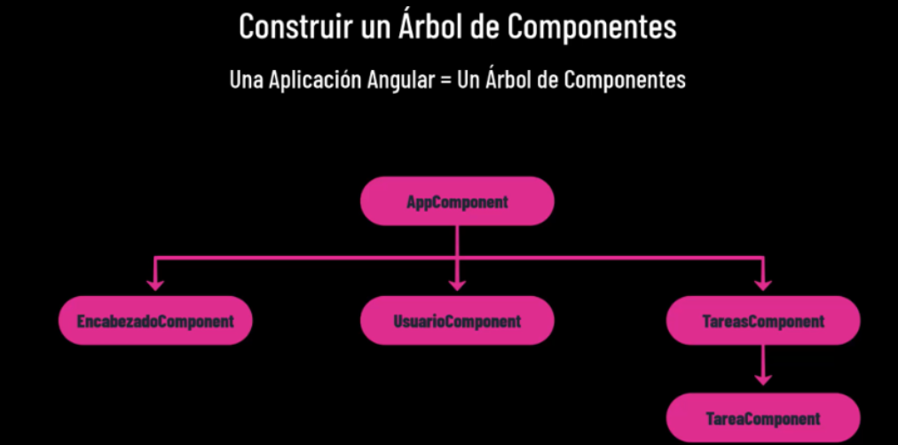
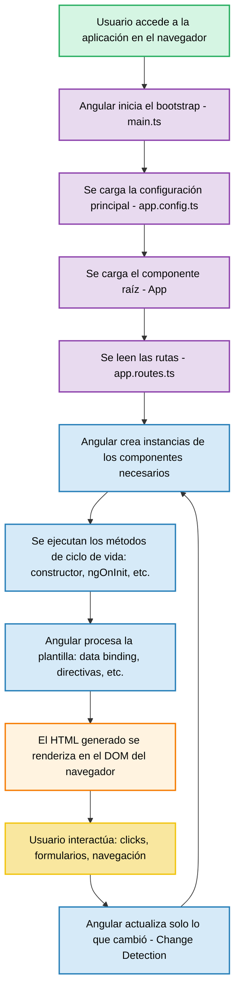
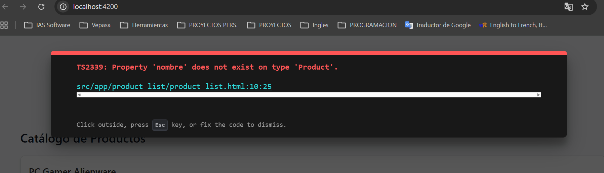
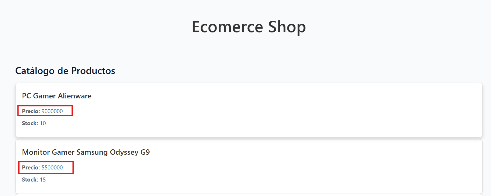
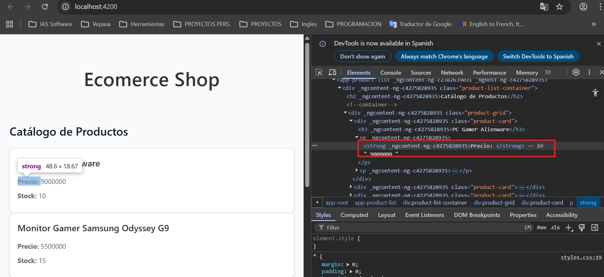
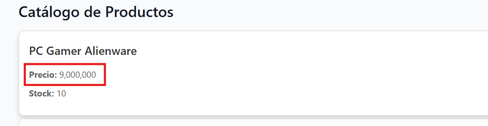
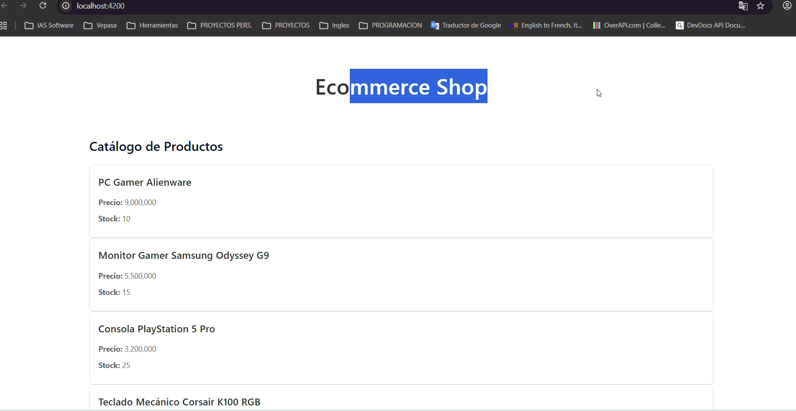

# 📚 DAY 1 - Fundamentos de Angular 20

## 📖 Tabla de Contenidos
1. [Introducción a Angular](#introducción-a-angular)
2. [Componentes Standalone](#componentes-standalone)
3. [Estructura de Proyecto](#estructura-de-proyecto)
4. [Archivos Principales](#archivos-principales)
5. [Conceptos Clave](#conceptos-clave)
6. [Diferencias de Términos](#diferencias-de-términos)
7. [Flujo de Renderizado](#flujo-de-renderizado)

---

## Introducción a Angular

### ¿Qué es Angular?

Angular es un **framework robusto de frontend** mantenido por Google, ideal para:
- ✅ Aplicaciones empresariales de gran escala
- ✅ Arquitectura modular y escalable
- ✅ Herramientas de desarrollo integradas
- ✅ Tipado estático con TypeScript
- ✅ Ecosistema maduro y bien documentado

### Características Principales

- **Single Page Application (SPA)**: Una sola página HTML que se recarga dinámicamente
- **Código Declarativo**: Define qué mostrar, no cómo hacerlo
- **Separación de Responsabilidades**: Organizado en componentes independientes
- **Programación Orientada a Objetos**: Uso de clases y herencia
- **TypeScript**: No JavaScript puro, sino tipado estático
  
  
*Figura 1: Arquitectura general de Angular*  
*Fuente: [ed.team](https://ed.team/blog/que-es-angular)*

## Conceptos Principales de Angular

| Concepto | Definición | Ejemplo | Equivalente Java/Spring |
|----------|-----------|---------|------------------------|
| **Módulo (NgModule)** | Agrupa componentes, servicios y recursos | `@NgModule({ ... })` | `@Configuration` |
| **Componente** | Unidad de UI con lógica, plantilla y estilo | `@Component({ ... })` | `@Controller + MVC` |
| **Plantilla (Template)** | Vista HTML con binding de datos | `<h1>{{title}}</h1>` | JSP/Thymeleaf |
| **Servicio** | Lógica reutilizable, inyectable | `@Injectable()` | `@Service` |
| **Inyección de Dependencias (DI)** | Sistema automático de proveer objetos | `constructor(private api: ApiService)` | `@Autowired` |
| **Routing** | Navegación entre vistas/componentes | `RouterModule.forRoot([...])` | `@RequestMapping` |
| **Pipe** | Transforma datos para mostrar | `{{ date \| date }}` | Filtros/Formatters |
| **Directiva** | Modifica comportamiento del DOM | `*ngIf="isShown"` | Custom tags, JSTL |
| **Input** | Componente hijo recibe datos | `@Input() data;` | Constructor args |
| **Output** | Hijo emite eventos al padre | `@Output() changed = new EventEmitter()` | Listeners/Callbacks |
| **Observable** | Maneja flujos de datos asíncronos | `this.api.getData().subscribe(...)` | Flux, CompletableFuture |
| **HttpClient** | Peticiones HTTP | `this.http.get('/api')` | RestTemplate |
| **Guard** | Controla acceso a rutas | `canActivate: [AuthGuard]` | Security Filter |
| **Interceptor** | Manipula solicitudes HTTP | `HttpInterceptor` | ClientHttpRequestInterceptor |
| **Signals** | Estado reactivo moderno | `signal(value)` | Bean singleton |

---

## Componentes Standalone

### ¿Qué son?

Los **componentes standalone** son componentes Angular independientes que **no necesitan estar declarados en un NgModule** para ser utilizados. Introducidos en Angular v14, son la nueva forma recomendada de construir aplicaciones.



*Figura 2: Arbol de componentes de una aplicación en Angular*  
*Fuente: [udemy - Angular Total](https://www.udemy.com/course/angular-total/)*


### Características

✨ **No requieren NgModule**  
✨ **Importan directamente componentes, directivas y pipes**  
✨ **Más modulares y fáciles de mantener**  
✨ **Mejor para nuevos desarrolladores**  

### Ejemplo

```typescript
@Component({
  selector: 'app-product-list',
  imports: [CommonModule], // Importa directamente
  templateUrl: './product-list.html',
  styleUrl: './product-list.css',
  standalone: true // Explícito (opcional en Angular 17+)
})
export class ProductList {
  // Lógica del componente
}
```

### Diferencias: Tradicional vs Standalone

| Aspecto | Tradicional | Standalone |
|--------|-----------|-----------|
| Requiere NgModule | ✅ Sí | ❌ No |
| Declaración | En `declarations` | En decorador |
| Importa | Módulos completos | Componentes individuales |
| Complejidad | Mayor | Menor |

**Nota**: A partir de Angular 17, por defecto son standalone.

---

## Estructura de Proyecto

Cuando creas un proyecto con `ng new nombre-proyecto`, se genera:

```
proyecto-angular/
├── src/
│   ├── app/                 # Corazón de la aplicación
│   │   ├── components/      # Componentes
│   │   ├── services/        # Servicios
│   │   ├── models/          # Interfaces y tipos
│   │   ├── app.ts           # Componente raíz
│   │   ├── app.config.ts    # Configuración
│   │   ├── app.routes.ts    # Rutas
│   │   ├── app.html         # Template raíz
│   │   └── app.css          # Estilos
│   ├── index.html           # HTML principal
│   ├── main.ts              # Punto de entrada
│   ├── styles.css           # Estilos globales
│   └── ...
├── angular.json             # Configuración del proyecto
├── package.json             # Dependencias y scripts
└── ...
```

---

## Archivos Principales

### `main.ts` - Punto de Entrada

Es el archivo principal que **arranca la aplicación** (como `main()` en Java).

**Responsabilidades:**
- Inicializar el módulo/configuración raíz
- Bootstrapear el componente principal
- Configurar entorno (desarrollo/producción)

### `app.config.ts` - Configuración Global

Archivo de configuración de la aplicación.

**Equivalente**: `application.properties` en Spring Boot

**Contiene:**
- Proveedores (providers)
- Inyección de dependencias
- Configuración global

### `app.routes.ts` - Rutas de la Aplicación

Define cómo se **navega entre componentes**.

**Ejemplo:**
```typescript
export const routes: Routes = [
  { path: '', component: HomeComponent },
  { path: 'login', component: LoginComponent },
  { path: 'products', component: ProductListComponent }
];
```

### `Componentes`

**Unidades fundamentales** de Angular.

**Estructura:**
- `component.ts` - Lógica TypeScript
- `component.html` - Plantilla (Template)
- `component.css` - Estilos

**Ejemplo:**
```typescript
@Component({
  selector: 'app-product-list',
  templateUrl: './product-list.html',
  styleUrl: './product-list.css'
})
export class ProductList {
  // Lógica
}
```

### `Servicios`

Clases que manejan **lógica reutilizable** sin UI.

**Ejemplo:**
```typescript
@Injectable()
export class ApiService {
  constructor(private http: HttpClient) {}
  
  getProducts() {
    return this.http.get('/api/products');
  }
}
```

### `Modelos`

Interfaces/Clases que representan la **estructura de datos**.

**Ejemplo:**
```typescript
export interface Product {
  id: string;
  name: string;
  price: number;
  stock: number;
  category: string;
}
```

---

## Diferencias de Términos

| Término | ¿Qué es? | ¿Dónde se usa? | Propósito | Ejemplo |
|---------|----------|----------------|----------|---------|
| **Componente** | Clase con lógica + UI | App Angular | Manejar y mostrar datos/interacciones | Formulario de login |
| **Template** | HTML del componente | Dentro del componente | Define qué se muestra visualmente | Campos de texto, botones |
| **Servicio** | Clase de lógica reutilizable | Compartido por componentes | Manejar datos e interacción con APIs | Servicio para obtener usuarios |
| **Ruta** | Configuración de navegación | app-routing.ts | Permitir ir entre vistas (SPA) | `/login`, `/home` |
| **Modelo** | Clase/interfaz de datos | Servicios y componentes | Representar estructura de datos | `interface User { id, nombre }` |

**Resumen rápido:**
- 🎨 **Componente** = Lógica + Vista
- 📄 **Template** = Solo HTML (vista)
- ⚙️ **Servicio** = Solo lógica (sin UI)
- 🗺️ **Ruta** = Navegación entre pantallas
- 📦 **Modelo** = Estructura de datos

---

## Flujo de Renderizado

### 📊 Diagrama de Flujo — Renderizado Angular



### Descripción del Flujo:

1. **Usuario accede** → El navegador carga la aplicación
2. **Bootstrap (main.ts)** → Angular inicializa la aplicación
3. **Configuración (app.config.ts)** → Carga proveedores y configuraciones
4. **Componente raíz (App)** → Carga el componente principal
5. **Rutas (app.routes.ts)** → Determina qué componente mostrar según la URL
6. **Instanciación** → Angular crea los componentes necesarios
7. **Ciclo de vida** → Ejecuta constructor, ngOnInit, etc.
8. **Procesamiento** → Data binding, directivas, interpolación
9. **Renderizado** → El HTML se muestra en el DOM
10. **Interacción** → Usuario hace click, escribe, navega
11. **Change Detection** → Angular detecta cambios y actualiza solo lo necesario
12. **Ciclo continuo** → Vuelve al paso 6 según sea necesario

---

## Ciclo de Vida de un Componente

Angular ejecuta métodos en este orden:

1. **constructor()** - Inicialización básica
2. **ngOnInit()** - Inicialización después de que Angular crea el componente
3. **ngDoCheck()** - Detecta cambios
4. **ngOnDestroy()** - Limpieza antes de destruir el componente

---

## Referencias y Recursos

- 📌 [mcherrera.dev](https://mcherrera.dev/posts/angular-arquitectura/)
- 📌 [medium.com](https://mcherrera.dev/posts/angular-arquitectura/)
- 📌 [codingpotions](https://mcherrera.dev/posts/angular-arquitectura/)
- 📌 [ed.team](https://mcherrera.dev/posts/angular-arquitectura/)
- 📌 [angular.io](https://mcherrera.dev/posts/angular-arquitectura/)

---

**📝 Notas finales:**
- Angular es ideal para aplicaciones complejas y escalables
- Los componentes standalone simplifican el desarrollo
- TypeScript proporciona seguridad de tipos
- La inyección de dependencias facilita el testing

---

## 📄 Entregables del Dia
### 🐛 BUGS
1. **Un producto no se muestra porque el nombre de la propiedad está mal escrito:**
Generé el BUG copiando mal el nombre de la propiedad `product.name` por `product.nombre`
en el template HTML `product-list.html` asi:
```html
<div class="product-card">
  <h3>{{ product.nombre }}</h3>
  <p><strong>Precio: </strong> {{ product.price | number}} </p>
  <p><strong>Stock: </strong> {{ product.stock }} </p>
</div>
```
lo que ocaciona que no me renderice en pantalla mostrandome el siguiente error:
<span style="color:#ff5555">TS2339: Property 'nombre' does not exist on type 'Product'.</span>

  
*Figura 3: Error generado por un mal tipado en una propiedad del template HTML.*

### Solución
Se identifica el tipo de error que muestra a la hora de compilar la aplicación, donde claramente evidencia
que la propiedad `nombre` no existe en la interfaz `Product`, ya que el campo declarado alli se llama
`name` produciendo la desincronización entre ambos archivos, por consiguiente me dezplazo a la ruta del 
archivo tamplate que me señala el error: <span style="color:#2dd9da"><u>src/app/product-list/product-list.html:10:25</u></span> 
y corrijo la propiedad por el nombre correcto a `name`, asi:
```html
<div class="product-card">
  <h3>{{ product.name }}</h3>
  <p><strong>Precio: </strong> {{ product.price | number}} </p>
  <p><strong>Stock: </strong> {{ product.stock }} </p>
</div>
```

2. **Un precio se muestra como texto sin formato:**
Actualmente uso el pipe `number` de Angular para dar formato a propiedades de números
o monedas, lo que hice para generar el bug es eliminar dicho pipe de la propiedad `price` 
del template HTML `product-list.html`, asi:

```html
<p><strong>Precio: </strong> {{ product.price }} </p>
```
Esto ocasiona que al momento de renderizar la aplicación, en el campo **Precio**, me muestre
el valor numérico sin ningun tipo de formato de comas, separadores o simolo de monedas, 
tal como se muestra en la imagen:
  
*Figura 4: Error generado al eliminar el pipe number de la propiedad Price.*

### Solución
Se identifica por medio de la *consola del desarrollador* que el label **Precio** que se renderiza 
en la interfaz gráfica, es una propiedad de tipo number del campo `price` del objeto `product` tal 
como se muestra en la imagen:
  
*Figura 5: Identificación en la consola del desarrollador del campo Precio.*

y una vez identificada la propiedad en el template HTML de `product-list.html`, se procede a agregar
el pipe `number` correspondiente al formateo de monedas para una mejor visualización del valor, asi:

```html
<p><strong>Precio: </strong> {{ product.price | number }} </p>
```

Evidenciando que la interfaz grafica en el campo **Price** su valor se imprime con el formato adecuado.
  
*Figura 6: Evidencia formato correcto de moneda.*

3. **Un producto con stock 0 aparece como disponible:**
Para generar el BUG, en la directiva `@if`, donde se realiza la validación
`products().length === 0`, establecí que no habia *stock*, mostrando por consiguiente el mensaje de **Disponible**.
```html
@if (products().length === 0) {
<p class="no-products">Disponible</p>
}
```
### Solución
Para corregir el BUG, lo que realice es verificar donde estaba mostrando en el Template HTML
`product-list.html` el mensaje *Disponible* y corregi la lógica de la validación para que tuviera el
comportamiento esperado y es que si el objeto que se llame en su stock no tiene productos (cero productos)
entondes me muestre un mensaje de *No hay productos disponibles*, asi:
```html
@if (products().length === 0) {
<p class="no-products">No hay productos disponibles</p>
}
```


💻 CAPTURA APLICACIÓN FUNCIONAL
  
*Figura 7: Evidencia Aplicación funcional.*

---
### METADATOS DEL DOCUMENTO 📄

| Campo                    | Detalles                                                           |
|:-------------------------|:-------------------------------------------------------------------|
| **Título**               | DAY 1 - FUNDAMENTOS DE ANGULAR 20                                  |
| **Autor(es)**            | Saul Echeverri                                                     |
| **Versión**              | 1.0.0                                                              |
| **Fecha de Creación**    | 04 de Mayo de 2026                                                 |
| **Última Actualización** | 05 de Mayo de 2026                                                 |
| **Notas Adicionales**    | Documento base de referencia para el plan de formación en Angular. |

---

