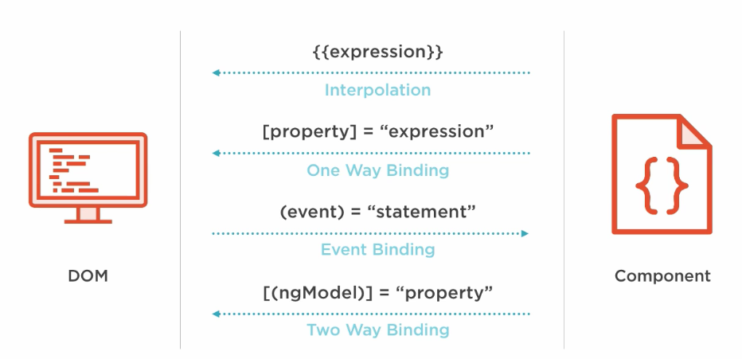
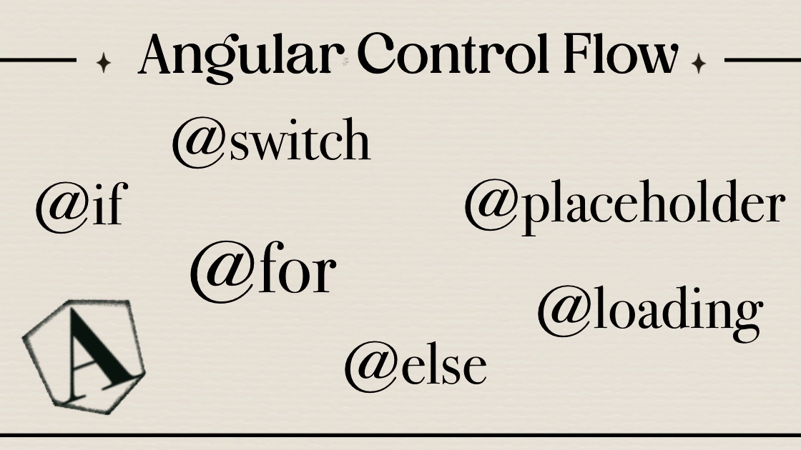

# 📚 DAY 2 - Templates, binding y control flow moderno

## 📖 Tabla de Contenidos
- [Binding](#binding)
  1. [Interpolación {{expression}}](#1-interpolación-expression)
  2. [Property Binding [prop]](#2-property-binding-prop)
  3. [Event Binding: (event)](#3-event-binding-event)
  4. [Binding Bidireccional: [(ngModel)] o [()]](#4-binding-bidireccional-ngmodel-o-)
  5. [Tabla Resumen Bindings](#tabla-resumen-bindings)
- [Control Flow Moderno (Anteriormente Directivas)](#control-flow-modero-anteriormente-directivas)
  6. [@if / @else](#1-if--else)
  7. [@for / @empty](#2-for--empty)
  8. [@switch / @case / @default](#3-switch-case-default)
  9. [Tabla comparativa: Controles de flujo modernos vs directivas clásicas Angular](#tabla-comparativa-controles-de-flujo-modernos-vs-directivas-clásicas-angular)
- [Referencias y Recursos](#referencias-y-recursos)
- [Entregables del Dia](#entregables-del-dia)
- [METADATOS DEL DOCUMENTO](#metadatos-del-documento)
---

## Binding
  
*Figura 1: Tipos de Binding.*  
*Fuente: [soka.gitlab.io](https://soka.gitlab.io/angular/conceptos/data-binding/data-binding/)*

### 1. Interpolación {{expression}}
En Angular, la interpolación es una forma de vincular datos de la clase del componente a la vista de 
la plantilla. Permite insertar contenido dinámico, como cadenas de texto, expresiones o valores de 
variables, directamente en el HTML.

**Sentido**: _Unidireccional_  
Componente (TS) → Vista (HTML)

**Explicación**: Muestras un valor calculado en el TS en el template.
Si cambia el valor en el componente, se refleja en la vista.

**Ejemplo**: 
```html
<h1>{{ usuarioSeleccionado.nombre }}</h1> 
```
**¿Cuándo utilizar?**
- Cuando se necesita mostrar en la vista valores calculados, expresiones, 
texto, números, etc.
- Ideal para imprimir propiedades o resultados en elementos HTML (títulos, 
párrafos, tooltips, etc).
- Cuando el elemento solo requiere mostrar información y no controla una 
propiedad DOM real (usa property binding para eso).
- Ejemplo típico: nombres de usuario, mensajes, contadores visibles.

### 2. Property Binding [prop]
Es el mecanismo de enlace de datos unidireccional en Angular que permite pasar valores 
desde la lógica del componente (TypeScript) hacia las propiedades de los elementos del 
DOM o de otros componentes.

**Sentido**: _Unidireccional_  
Componente (TS) → Vista (HTML)

**Explicación**: Pasas un valor/calculado desde el componente a una propiedad 
del elemento/directiva/componente. Si la variable cambia en TS, actualiza la vista 
automáticamente.

**Ejemplo**:
```html
  
```
**¿Cuándo utilizar?**
- Cuando necesitas asignar valores dinámicos a propiedades reales del DOM 
(atributos no de texto plano, como `src`, `href`, `disabled`, `checked`, etc).
- Para pasar datos a `inputs` de componentes hijos o a directivas.
- Cuando quieras controlar de forma dinámica cosas como clases, estilos, rutas de 
imágenes, ids, valores booleanos.
- No apto para texto plano en HTML: en ese caso usa **interpolación**.
- Ejemplo: mostrar, ocultar, habilitar, cambiar imágenes, colores o enviar datos 
a componentes custom.

### 3. Event Binding: (event)
Mecanismo que permite a la vista (HTML) "escuchar" y responder a las acciones del 
usuario (clics, toques, pulsaciones de teclas, movimientos del mouse) ejecutando 
métodos en la clase del componente (TypeScript). Utiliza una sintaxis de paréntesis 
`(evento)="metodo()"` para vincular el evento del DOM al código del controlador.

**Sentido**: _Unidireccional_  
Vista (HTML) → Componente (TS)

**Explicación**: Ejecución de una función en TS cuando ocurre un evento DOM (ej. `click`,
`input`, `submit`) o de un `Output`. Conecta acciones del usuario con la lógica y actualiza 
datos.  
No es un binding de datos, es una notificación/llamada de función desde la vista.

**Ejemplo**:
```html
<button (click)="alSeleccionarUsuario()"> 
```
**¿Cuándo utilizar?**
- Para responder a acciones del usuario: clics, entradas de teclado, envíos de formularios, 
selección de opciones, cambios de estados.
- Para escuchar eventos de componentes hijos a través de outputs personalizados.
- Cuando necesitas que una interacción en la vista ejecute código en tu componente.
- jEjemplo: guardar un dato, navegar, actualizar variables al hacer clic.

### 4. Binding Bidireccional: [(ngModel)] o [()]
Two-way Binding (enlace bidireccional) es un mecanismo que sincroniza automáticamente los 
datos entre el componente (clase TypeScript) y la vista (plantilla HTML) en ambos sentidos. 
Si el usuario cambia un valor en la interfaz (input), la variable en el controlador se 
actualiza, y viceversa, facilitando el manejo de formularios.

**Sentido**: _Bidireccional_  
Componente (TS) <-> Vista (HTML)

**Explicación**: Se usa mayormente en formularios/editables. Si cambias el valor en TS 
o en la vista, ambos se sincronizan automáticamente.

**Ejemplo**:
```html
<input [(ngModel)]="nombre">
```
**¿Cuándo utilizar?**
- Cuando necesitas mantener sincronizados el modelo y la vista automáticamente, especialmente 
en formularios o campos editables.
- En formularios template-driven (ngModel), o personaliza para tus propios componentes 
(banana in a box).
- Cuando la variable puede cambiar por el usuario o por lógica de negocio, y quieres que ambos 
reflejen siempre el valor actual.
- Ejemplo: inputs de usuario, selects, checkboxes que deben reflejar y actualizar el valor en TS 
y en el UI a la vez.

### Tabla Resumen Bindings  

Tipo de binding | Sintaxis | Dirección de datos | Explicación breve |
| :--- | :--- | :--- | :--- |
| **Interpolación** | `{{ ... }}` | TS → HTML (uni) | Solo muestra, nunca actualiza TS |
| **Property binding** | `[propiedad]` | TS → HTML (uni) | Solo del TS a la vista |
| **Event binding** | `(evento)` | HTML → TS (uni) | Solo notifica de la vista con función TS |
| **Bidireccional** | `[(ngModel)]` | TS ↔ HTML (bi) | Vista y TS sincronizan valor |

---

## Control Flow Modero (Anteriormente Directivas)
El control flow moderno en Angular (introducido en la v17) es una sintaxis declarativa integrada 
(`@if`, `@for`, `@switch`) que reemplaza las antiguas directivas estructurales (`*ngIf`, `*ngFor`). 
Mejora la legibilidad, rendimiento y experiencia de desarrollo, siendo más intuitiva y cercana a 
JavaScript puro. No requiere importaciones en componentes standalone.

  
*Figura 2: Tipos de Conntroles de Flujo.*  
*Fuente: [dev.to](https://dev.to/angularfirebase/el-nuevo-control-flow-en-angular-118g)*

### 1. @if / @else
Reemplaza a `*ngIf`. Permite mostrar u ocultar elementos basándose en una expresión booleana

**Ejemplo**:
```html
@if (usuarioLogueado) {
  <p>Bienvenido, usuario.</p>
} @else {
  <button>Iniciar Sesión</button>
}
```
**¿Cuándo utilizar?**
- Cuando necesitas mostrar u ocultar partes de la vista dependiendo de una condición.
- Ejemplo: Mensajes de error, login/logout, mostrar contenido solo si existe información.
- @else Cuando quieres mostrar una alternativa si la condición de @if no se cumple.
- Ejemplo: Mostrar un mensaje de "no hay datos" cuando una lista está vacía.

### 2. @for / @empty
Reemplaza a `*ngFor`. Se utiliza para iterar sobre listas y renderizar elementos repetidamente

**Ejemplo**:
```html
@for (item of listaItems; track item.id) {
  <li>{{ item.nombre }}</li>
} @empty {
  <p>La lista está vacía.</p>
}
```
**¿Cuándo utilizar?**
- Cuando necesitas mostrar una lista de elementos, tarjetas, filas de tabla, etc.
- Ejemplo: Catálogos de productos, listas de usuarios, mensajes.
- El `@empty` se puede colocar al final de un bloque `@for` para mostrar contenido cuando 
el array a iterar está vacío.

### 3. @switch, @case, @default
El `@switch` Reemplaza a `*ngSwitch`. Permite renderizar uno de varios elementos basándose 
en el valor de una expresión.
Estas permiten mostrar distintos bloques de vista dependiendo del valor de una expresión, 
similar al switch/case tradicional.

**Ejemplo**:
```html
@switch (status) {
  @case ('activo') {
    <span>Activo</span>
  }
  @case ('inactivo') {
    <span>Inactivo</span>
  }
  @default {
    <span>Estado desconocido</span>
  }
}
```
**¿Cuándo utilizar?**
- Cuando tienes más de dos condiciones posibles para una variable y quieres evitar múltiples `@if` anidados.
- Ejemplo: Mostrar diferentes vistas o estilos según el estado de un pedido, usuario, proceso, etc.

### Tabla comparativa: Controles de flujo modernos vs directivas clásicas Angular

| **Concepto**    | **Control de flujo moderno** | **Sintaxis moderna**                         | **Directiva clásica** | **Sintaxis clásica**            | **¿Cuándo preferir?**                                                                        |
|-----------------|:---------------------------:|:--------------------------------------------:|:---------------------:|:-------------------------------:|:--------------------------------------------------------------------------------------------|
| Condicional     | `@if` / `@else`             | `@if (condición) { ... } @else { ... }`      | `*ngIf`			   | `<div *ngIf="condición">...</div>` | Proyectos Angular 17+ (mejor legibilidad y flujo). NgIf sigue siendo válido en proyectos legacy.	     |
| Iteración       | `@for` / `@empty`           | `@for (item of items) { ... } @empty { ... }`| `*ngFor`		   | `<div *ngFor="let item of items"></div>` | Angular 17+ (`@for` permite `@empty` para listas vacías y `track`). *ngFor en Angular 16 o menos. |
| Switch/Case     | `@switch` / `@case` / `@default` | `@switch (valor) { @case ... @default ... }` | `*ngSwitchCase`	   | `<div [ngSwitch]="valor"> <div *ngSwitchCase="'v'">...</div></div>` | Angular 17+ por legibilidad. *ngSwitch útil en proyectos previos.                             |
| Seguimiento (track) | `track`                 | `@for (item of items; track item.id)`         | `trackBy`			   | `<div *ngFor="let item of items; trackBy: fn">` | Angular 17+, track directo mejora optimización y sintaxis.                                  |

---

## Consideraciones

- Los **controles de flujo modernos** (`@if`, `@for`, `@switch`) requieren Angular 17+ y son recomendados para todos los proyectos nuevos.
- Las **directivas clásicas** (`*ngIf`, `*ngFor`, `*ngSwitchCase`) son ampliamente utilizadas y totalmente compatibles en versiones anteriores.
- Ambos enfoques pueden convivir en proyectos Angular 17+.
- El control flow moderno mejora la legibilidad, flexibilidad (bloques anidados), permite `@empty` y una mejor asociación con lógica de TypeScript.
- Para código legacy o migraciones, las directivas clásicas siguen siendo una buena opción.

---


## Referencias y Recursos

- 📌 [Angular Docs: Control Flow](https://angular.dev/reference/templates/control-flow)
- 📌 [medium.com](https://normeno.medium.com/introducci%C3%B3n-a-angular-eaee950163db)
- 📌 [Angular Docs: Built-in Directives](https://angular.io/guide/built-in-directives)
- 📌 [Dev.to](https://dev.to/angularfirebase/el-nuevo-control-flow-en-angular-118g)
- 📌 [soka.gitlab](https://soka.gitlab.io/angular/conceptos/data-binding/data-binding/)


<br><br><br><br><br><br><br><br><br><br><br><br><br><br>

---

## 📄 Entregables del Dia
### 🐛 BUGS


<br><br><br><br><br><br><br><br><br><br><br><br><br><br>


---
### 📄 METADATOS DEL DOCUMENTO 

| Campo                    | Detalles                                                           |
|:-------------------------|:-------------------------------------------------------------------|
| **Título**               | DAY 2 - TEMPLATES, BINDING Y CONTROL FLOW MODERNO                  |
| **Autor(es)**            | Saul Echeverri                                                     |
| **Versión**              | 1.0.0                                                              |
| **Fecha de Creación**    | 05 de Mayo de 2026                                                 |
| **Última Actualización** | 06 de Mayo de 2026                                                 |
| **Notas Adicionales**    | Documento base de referencia para el plan de formación en Angular. |

---

