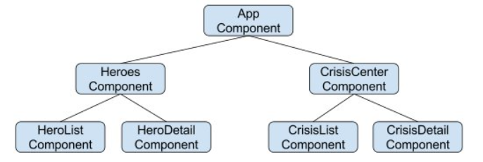
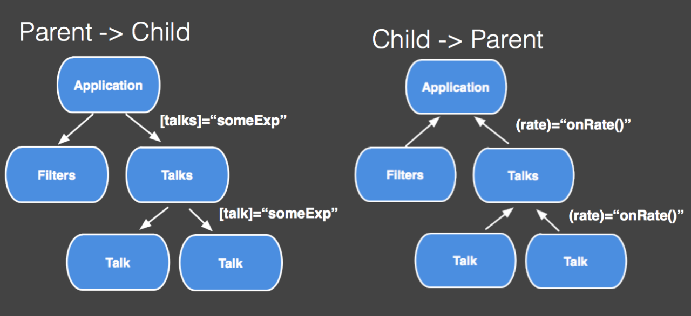

# 📚 DAY 3 - Componentes, inputs, outputs y separación de responsabilidades

## 📖 Tabla de Contenidos
1. [Cómo dividir una pantalla en componentes](#como-dividir-una-pantalla-en-componentes)
2. [@Input](#input)
3. [@Output](#output)
4. [Comunicación padre-hijo](#comunicación-padre-hijo)
5. [¿Cuándo crear un componente nuevo?](#cuándo-crear-un-componente-nuevo)
6. [Diferencia entre componente contenedor y componente visual (presentacional)](#diferencia-entre-componente-contenedor-y-componente-visual-presentacional)
7. [Evitar componentes demasiado grandes](#evitar-componentes-demasiado-grandes)  
   [Resumen Visual](#resumen-visual)  
   [Referencias](#referencias)
---

## Teoría

### 1. Cómo dividir una pantalla en componentes
- Divide una interfaz grande en partes lógicas y reutilizables.
- Cada componente debe encargarse de una única responsabilidad visual o funcional (single responsibility).
- Esto facilita el mantenimiento, testing y reuso.

  
*Figura 1: Ejemplo de estructura de componentes.*  
*Fuente: [codingpotions](https://codingpotions.com/angular-componentes/)*

**Ejemplo**:
```html
[AppComponent]
  ├── [HeaderComponent]
  ├── [ProductFilterComponent]
  ├── [ProductListComponent]
  │       └── [ProductCardComponent]
  └── [FooterComponent] 
```
---

### 2. @Input
- Decorador que permite a un componente hijo RECIBIR datos del padre.
- Es una propiedad marcada para recibir valores desde afuera.

**Ejemplo**:  
*Componente hijo*:

```typescript
import { Component, Input } from '@angular/core';
@Component({
  selector: 'product-card',
  template: `<div>{{ product.name }}</div>`
})
export class ProductCardComponent {
  @Input() product!: Product; // Recibe el producto del padre
  valor = input<number>();  // ¡Así se recibe un input como signal!
} 
```

*Uso en el padre*:
```html
<product-card [product]="unProducto"></product-card> 
```
---

### 3. @Output
- Decorador que permite a un componente hijo EMITIR eventos que el padre puede escuchar y manejar.
- Se usa junto a EventEmitter.

**Ejemplo**:  
*Hijo*:
```typescript
import { Component, Output, EventEmitter, signal } from '@angular/core';

@Component({
  selector: 'counter',
  template: `<button (click)="notify()">Click</button>`
})
export class CounterComponent {
  @Output() clicked = new EventEmitter<void>();

  parentValue = signal(42); //Con signals
  
  notify() {
    this.clicked.emit();
  }
} 
```
*Padre*:
```html
<counter (clicked)="onChildClicked()"></counter> 
```
📌 *Notas*:
- El hijo recibe el input como un signal reactivo y lo consume con paréntesis: valor().
- El padre puede mandar un signal o un literal, lo importante es que el hijo lo recibe de forma reactiva.

  
*Figura 2: Comunicación padre-hijo.*  
*Fuente: [hahoangv](https://hahoangv.wordpress.com/2016/05/21/angular-2-essentials-component-with-inputs-and-outputs/)*

---

### 4. Comunicación padre-hijo
- Padre → Hijo:
Usando `@Input`, el padre pasa datos al hijo.

- Hijo → Padre:
Usando `@Output`, el hijo notifica al padre de acciones o cambios.


**Ejemplo combinado**:
```html
<product-card [product]="item" (addedToCart)="handleAdd($event)"></product-card>  
```

- Aquí el padre pasa info del producto al hijo...
- ...y el hijo le avisa al padre cuando el producto se agrega al carrito.

---

### 5. ¿Cuándo crear un componente nuevo?
- Cuando una parte de la UI:
  - Es reutilizable en otras secciones. 
  - Tiene funcionalidad propia (lógica o interacción). 
  - Hace el código más legible y fácil de mantener.
- Cuando empieza a crecer el tamaño/funcionalidad de una sección.

**Ejemplo**:
*Si el listado y el filtro empiezan a tener mucha lógica interactiva propia, sepáralos en componentes específicos.*

---

### 6. Diferencia entre componente contenedor y componente visual (presentacional)
**Contenedor**
- Se encarga de manejar datos, estado y lógica de negocio.
- Suele orquestar la UI y pasar datos y callbacks a hijos visuales.

**Ejemplo**:
```typescript
 @Component({ /* ... */ })

export class ProductListContainer {

  // filtra, busca, pagina, obtiene productos, etc.
  
} 
```
**Visual (Presentacional)**:
- Solo se encarga de mostrar datos y recibir los callbacks.
- Es “tonto”, pues no sabe de dónde vienen los datos ni qué pasa con ellos después.

**Ejemplo**:
```typescript
@Component({ /* ... */ })
export class ProductCardComponent {
  @Input() product: Product;
  @Output() addedToCart = new EventEmitter<Product>();
} 
```

---

### 7. Evitar componentes demasiado grandes
**Problema**
- Un solo componente con mucha lógica es difícil de entender, mantener y probar.

**Solución**
- Divide la lógica en subcomponentes responsables de partes pequeñas.
- Un componente grande debería ser refactorizado en varios componentes pequeños.

**Ejemplo visual**:
Si en ProductListComponent tienes tanto la lógica de filtrado, paginación, listado, 
interacción de cards, etc., parte la UI y lógica en ProductFilterComponent, PaginatorComponent, 
ProductCardComponent, y así sucesivamente.


### Resumen Visual

| Concepto                     | ¿Qué es?                                    | Ejemplo clave                              |
|------------------------------|---------------------------------------------|--------------------------------------------|
| Dividir componentes          | Separa la UI por bloques lógicos            | ProductList, ProductCard, ProductFilter    |
| @Input                       | Permite recibir datos del padre             | [dato]="valor" en el template              |
| @Output                      | Permite emitir eventos al padre             | (evento)="accion()" en el template         |
| Comunicación Padre-Hijo      | @Input (padre→hijo), @Output (hijo→padre)   | [input] y (output)                         |
| ¿Cuándo crear componente?    | Cuando hay reuso o lógica propia            | Lógica propia o sección que crece          |
| Contenedor vs. Visual        | Lógica/estado vs. solo UI                   | Uno orquesta, el otro dibuja               |
| Evitar grandeza              | Divide si es complejo                       | Refactorizar UI compleja                   |
---

## Referencias y Recursos

- 📌 [codingpotions](https://codingpotions.com/angular-componentes/)
- 📌 [medium.com](https://normeno.medium.com/introducci%C3%B3n-a-angular-eaee950163db)
- 📌 [Angular Docs: Built-in Directives](https://hahoangv.wordpress.com/2016/05/21/angular-2-essentials-component-with-inputs-and-outputs/)


<br><br><br><br><br><br><br><br><br><br><br><br><br><br>

---

## 📄 Entregables del Dia
### 🐛 BUGS


<br><br><br><br><br><br><br><br><br><br><br><br><br><br>


---
### 📄 METADATOS DEL DOCUMENTO 

| Campo                    | Detalles                                                               |
|:-------------------------|:-----------------------------------------------------------------------|
| **Título**               | DAY 3 - COMPONENTES, INPUTS, OUTPUTS Y SEPARACIÓN DE RESPONSABILIDADES |
| **Autor(es)**            | Saul Echeverri                                                         |
| **Versión**              | 1.0.0                                                                  |
| **Fecha de Creación**    | 07 de Mayo de 2026                                                     |
| **Última Actualización** | 08 de Mayo de 2026                                                     |
| **Notas Adicionales**    | Documento base de referencia para el plan de formación en Angular.     |

---

