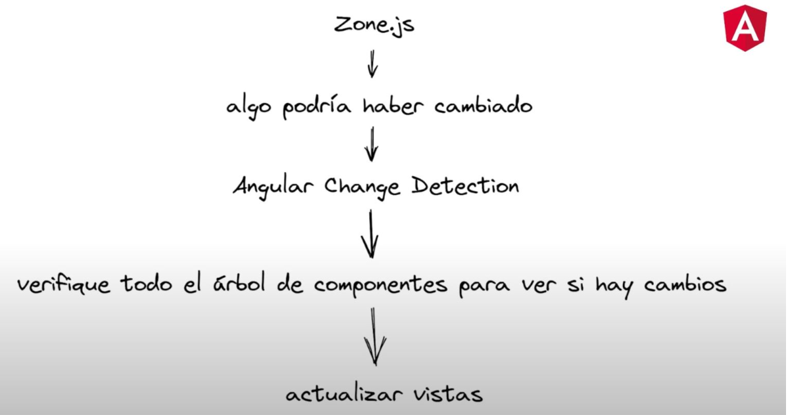
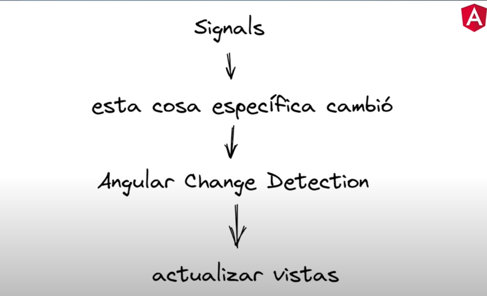

# 📚 DAY 4 - Signals y estado local

## 📖 Tabla de Contenidos

1. [Signals](#1-signals)
2. [Computed](#2-computed)
3. [Effect](#3-effect)
4. [Diferencia entre variable normal y signal](#4-diferencia-entre-variable-normal-y-signal)
5. [Estado derivado](#5-estado-derivado)
6. [Cuándo usar computed en lugar de recalcular manualmente](#6-dcuándo-usar-computed-en-lugar-de-recalcular-manualmente)
7. [Resumen Visual](#resumen-visual)
8. [Referencias y Recursos](#referencias-y-recursos)
---

## Teoría

### 1. Signals
#### Como se ejecuta la detección de cambios en Angular?
Hasta ahora, Angular confiaba en un mecanismo de detecciön de cambios
conocido como checking", Angular verificaba periödicamente el estado de
los componentes para detectar si se habian producido modificaciones. Para ello se
usa la libreria Zone.js que mediante Angular Change detection, que båsicamente Io
que hace es escuchar cada uno de los cambios que se producen y para lograrlo
verifica cada componente y su arbol de componentes hijos en busca de cambios.

Esto implicaba recorrer y comparar cada propiedad de cada componente en cada ciclo de detecciön, Aunque
esta técnica es efectiva en la mayoria de los casos, se vuelve ineficiente en aplicaciones mås grandes con gran
cantidad de componentes servicios, a medida que nuestra aplicaciön va creciendo, la detecciön se vuelve mås
lenta, aumentando el consumo de recurso dificultando la escalabilidad y mantenibilidad del proyecto.

  
*Figura 1: Mecanismo de detección de cambios conocido como **dirty checking** de Zone.js.  
*Fuente: [Viewnext](https://www.viewnext.com/angular-y-signals-transformando-el-desarrollo-web/)*

#### Signals:
En **Angular 16, se introdujo Signals**, una nueva implementaciön que ha revolucionado la detecciön de cambios.
**Signals se basa en una arquitectura de suscripciön y eventos, Io que permite detectar y actualizar solo los
cambios relevantes en Lugar de recorrer todo el arbol de componentes.** Esto conduce a un mejor rendimiento,
una mayor velocidad de renderizado y una optimizaciön de recursos al reducir la carga de trabajo del sistema.
Ademås, la arquitectura de Signals facilita la creaciön de aplicaciones reactivas y permite a Los
desarrolLadores responder eficientemente a los cambios en Los datos y en el estado de La aplicaciön.

  
*Figura 2: Mecanismo de detección de cambios usando **signals.**  
*Fuente: [Viewnext](https://www.viewnext.com/angular-y-signals-transformando-el-desarrollo-web/)*

Un *Signal* es un contenedor de valor reactivo:
- Guarda un valor.
- Notifica (“emite”) automáticamente a los consumidores (tu HTML, otros signals, etc.) cada vez que cambia.
- Evita el uso de observables, subscriptions y zone.js para la mayoría de los casos de uso de UI reactivo.

### Ventanjas con resecto a Zone.js
- Mejor rendimiento.
- Optimización de recursos.
- Desarrollo mas ágil.
- Mantenibilidad y escalabilidad.

**Ejemplo**:
```typescript
import { Component, signal } from '@angular/core';
@Component({
  selector: 'my-counter',
  template: `
    <button (click)="increase()">+1</button>
    <span>Valor: {{ count() }}</span>
  `
})
export class MyCounter {
  count = signal(0);

  increase() {
    this.count.set(this.count() + 1);
  }
} 
```

En Angular, usas el signal como función en el template:
```html
<p>Nombre: {{ name() }}</p>
<input [value]="name()" (input)="name.set($event.target.value)">
```

---

### 2. Computed
Como dijimos en el apartado anterior, un **signal** es un contenedor 
reactivo alrededor de un valor. Puedes leer el valor llamando al signal 
como una función ( count()), y actualizarlo usando .set(), .update(), o .mutate().

**Computed** es una función de Angular (desde la introducción de signals) que 
permite crear señales derivadas (o computadas) a partir de una o más signals existentes.

computed() Crea una señal de solo lectura cuyo valor se deriva de otras señales. 
Realiza un seguimiento automático de las dependencias y las recalcula cuando alguna de ellas cambia.

Caso de uso: Perfecto para estados derivados; piense en cosas como fullName basadas en firstName y lastName.

**Ejemplo**:
```typescript
import { signal, computed } from '@angular/core';

const precioUnitario = signal(10);
const cantidad = signal(3);

// Creamos una signal computada:
const total = computed(() => precioUnitario() * cantidad());

console.log(total());  // 30

cantidad.set(5);
console.log(total());  // 50 (¡se recalcula solo!)
```

---

### 3. Effect
Es una función del sistema de reactividad (Signals) que te permite ejecutar código secundario (“side effects”)
automáticamente cada vez que cambia el valor de una o más señales que depende. 
Funciona como un puente entre el estado reactivo y el "mundo exterior", siendo ideal 
para tareas como logging, manipulación del DOM, o guardar en localStorage.
- Se utiliza para reaccionar a cambios en signals fuera del template, como:
- Hacer llamadas HTTP,
- Guardar información en localStorage,
- Enviar logs,
- Actualizar servicios,
- O simplemente ejecutar cualquier acción que no sea solo renderizar la UI.

*Nota:*
- effect()Se ejecuta de inmediato y registra todas las señales utilizadas en su funcionamiento.
- Cuando cualquiera de esas señales se actualiza, el efecto se vuelve a ejecutar .
- Se limpia automáticamente y vuelve a suscribirse si las dependencias cambian dinámicamente.

**Ejemplo**:
```typescript
import { signal, effect } from '@angular/core';

const counter = signal(0);

effect(() => {
  console.log('El nuevo valor es:', counter());
});

counter.set(5); // Esto dispara el effect y muestra: El nuevo valor es: 5
counter.set(10); // Ahora: El nuevo valor es: 10 
```

---

### 4. Diferencia entre variable normal y signal.
La principal diferencia entre una variable normal (propiedad estándar de TypeScript) y 
una señal (Signal) en Angular es la reactividad automática y la eficiencia en la actualización 
de la interfaz de usuario (UI).


### Variable normal (tradicional)
**Ejemplo**:
```typescript
nombre: string = 'Saúl';
```
- Es una propiedad clásica de una clase/component.
- No es reactiva:
Si cambias el valor, Angular NO detecta el cambio automáticamente en la UI 
(a menos que uses mecanismos como ChangeDetectorRef, zonas o triggers como eventos).
- Necesitas ngModel, bindings bidireccionales, o detectar cambios explícitamente.

### Signal
**Ejemplo**:
```typescript
import { signal } from '@angular/core';
nombre = signal('Saúl');
```
- Es un contenedor reactivo de valor:
- 100% reactiva:
  Cuando cambias el valor con .set(...), Angular detecta el cambio y 
actualiza automáticamente la UI en todos los lugares donde lo uses.

### ¿Cuándo usar cada uno?
- Usa signals siempre que quieras que tu UI sea reactiva y consistente, sin preocuparte por 
el ciclo de change detection.
- Usa variables normales solo para cosas locales, estáticas o configuraciones temporales que no afectan la UI.

#### Tabla comparativa entre variable normal y signal
| Característica              | Variable normal                           | Signal                                    |
|-----------------------------|-------------------------------------------|-------------------------------------------|
| **Definición**              | `nombre: string = 'Saúl';`                | `nombre = signal('Saúl');`                |
| **Reactividad**             | No reactivo (no notifica cambios)         | Reactivo (notifica y actualiza UI)        |
| **Acceso en template**      | `{{ nombre }}`                            | `{{ nombre() }}`                          |
| **Cambio de valor**         | `nombre = 'Ana'`                          | `nombre.set('Ana')`                       |
| **Actualización automática UI** | Solo en zonas de Angular                | Siempre, automático                       |
| **Dependencias**            | No propaga a otros valores                | Sí, signals/computed/effect se enteran    |
| **Estado derivado**         | A mano, función o getter                  | Fácil con `computed(() => ...)`           |
| **Limpieza automática**     | No                                        | Sí, gestionado por Angular                |
| **Uso en side effects**     | Manual                                    | Vía `effect(() => ...)`                   |
| **Ideal para**              | Estado simple, no interactivo             | Estado UI reactivo (inputs, filtros, etc) |

---

### 5. Estado derivado
Es un concepto reactivo que se refiere a datos que se calculan automáticamente a partir de otro estado base (o estado primario).
Siempre depende de otros estados y se recalcula automáticamente cuando estos cambian.

**Ejemplo**:  
Supón que tienes:
- Un listado de productos (estado fuente)
- Un filtro de texto (estado fuente)

El estado derivado sería la lista de productos filtrados:
```typescript
// Estados fuente:
productos = signal([...]); // arreglo de productos originales
filtro = signal('zapatillas');

// Estado derivado (con computed):
productosFiltrados = computed(() =>
  productos().filter(prod => prod.nombre.toLowerCase().includes(filtro().toLowerCase()))
);
```
*Nota:*
- No se almacena (no haces .set() manual sobre él).
- Es por definición de solo lectura.
- Garantiza que la UI siempre esté sincronizada con el verdadero estado fuente.
- En Angular, normalmente se implementa con computed.


---

### 6. Cuándo usar computed en lugar de recalcular manualmente?
**Usa computed cuando...**
1. El valor depende de uno o varios signals de forma “reactiva” 
- Por ejemplo: totales, listas filtradas, validaciones, formateos, etc.
2. Quieres que el valor derivado siempre esté sincronizado con su(s) fuente(s), 
sin tener que preocuparte de actualizarlo manualmente.
3. Hay más de una fuente (como dos o más signals) que deben “disparar” el recálculo.
4. Tu template/tu lógica necesita acceder varias veces a ese valor derivado, sin repetir código.
5. Buscas evitar bugs de sincronización entre estado original y el calculado.


**Ejemplo**:
```typescript
filtro = signal('');
productos = signal([...]);

// Estado derivado automático:
productosFiltrados = computed(() =>
  productos().filter(p => p.nombre.includes(filtro()))
);
```
Si cambia el filtro o el arreglo de productos, la lista filtrada se actualiza ¡siempre sola!

**NO uses computed cuando:**
1. El valor no depende de signals, sino de variables locales simples.
2. Solo necesitas recalcular el valor ocasionalmente, y no necesitas que esté sincronizado con la UI.
3. Vas a modificar el valor a mano (los computed son readonly).

---


### Resumen Visual

| Concepto                                  | Definición Breve                                                                                  |
|-------------------------------------------|---------------------------------------------------------------------------------------------------|
| ¿Qué son signals?                         | Variables reactivas de Angular que notifican a la UI automáticamente cuando su valor cambia.      |
| signal                                    | Función para crear una variable reactiva que guarda un valor y permite leerlo/modificarlo.        |
| computed                                  | Función que define un valor calculado automáticamente a partir de otros signals; se actualiza solo cuando los signals que usa cambian. |
| effect                                    | Función que ejecuta código secundario (side effects) cada vez que cambian ciertos signals.        |
| Diferencia entre variable normal & signal | La variable normal solo cambia si tú la lees/actualizas. El signal reacciona y actualiza la UI automáticamente al cambiar.              |
| Estado derivado                           | Es un valor calculado (no almacenado directamente) a partir de uno o varios signals (ej: un filtro, un subtotal, etc).                  |
| ¿Cuándo usar computed?                    | Cuando tu valor depende de uno o más signals y quieres que se recalculen automáticamente. Evita recalcular manualmente en hooks o métodos.|
---

## Referencias y Recursos

- 📌 [Viewnext](https://www.viewnext.com/angular-y-signals-transformando-el-desarrollo-web/)
- 📌 [medium.com](https://medium.com/@eugeniyoz/application-state-management-with-angular-signals-b9c8b3a3afd7)
- 📌 [Angular Docs: signals](https://blog.angular-university.io/angular-signals/)


---
### 📄 METADATOS DEL DOCUMENTO 

| Campo                    | Detalles                                                           |
|:-------------------------|:-------------------------------------------------------------------|
| **Título**               | DAY 4 - SIGNALS Y ESTADO LOCAL                                     |
| **Autor(es)**            | Saul Echeverri                                                     |
| **Versión**              | 1.0.0                                                              |
| **Fecha de Creación**    | 11 de Mayo de 2026                                                 |
| **Última Actualización** | 11 de Mayo de 2026                                                 |
| **Notas Adicionales**    | Documento base de referencia para el plan de formación en Angular. |

---

