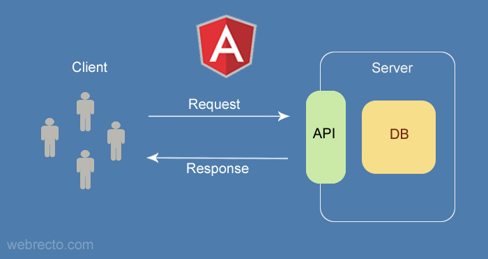
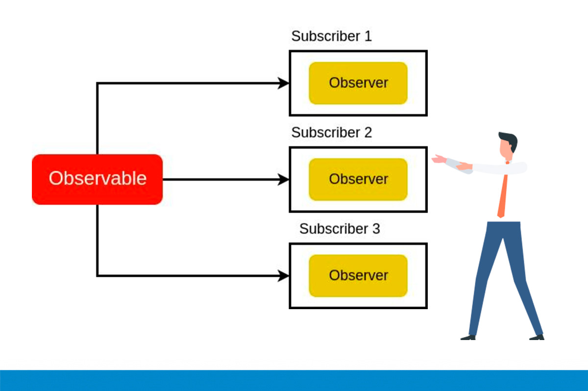

# 📚 DAY 7 - HTTP, errores y estados de carga

## 📖 Tabla de Contenidos

1. [HttpClient](#1-httpclient)
2. [Observables básicos](#2-observables-básicos)
3. [Consumo de API](#3-consumo-de-api)
4. [Estado de Carga (Loading State)](#4-estado-de-carga-loading-state)
5. [Estado de Error (Error State)](#5-estado-de-error-error-state)
6. [Estado Vacío (Empty State)](#6-estado-vacío-empty-state)
7. [Manejo básico de errores](#7-manejo-básico-de-errores)
8. [Diferencia entre error técnico y mensaje para usuario](#8-diferencia-entre-error-técnico-y-mensaje-para-usuario)  
[Resumen Visual](#resumen-visual)  
[Referencias y Recursos](#referencias-y-recursos)
---

## Teoría

### 1. HttpClient
En Angular, el módulo `HttpClient` nos permite realizar peticiones HTTP para interactuar con APIs 
y servidores externos. Es una herramienta esencial para cualquier aplicación que necesite comunicarse 
con una base de datos o un backend.

`HttpClient` es un servicio proporcionado por Angular dentro del módulo `@angular/common/http` que facilita 
la comunicación con servidores a través del protocolo HTTP. Permite realizar peticiones GET, POST, PUT, 
DELETE, entre otras, de manera sencilla y optimizada.

  
*Figura 1: El módulo HttpClient en Angular se utiliza para realizar solicitudes HTTP desde una aplicación a un servidor. 
Se puede emplear para obtener datos (mediante solicitudes GET), enviar datos (mediante solicitudes POST), actualizar datos 
(mediante solicitudes PUT) o eliminar datos (mediante solicitudes DELETE).  
*Fuente: [webrecto.com](https://www.webrecto.com/angular/angular-httpclient-get-example)*

**Ejemplo:**
```typescript
import { HttpClient } from '@angular/common/http';
constructor(private http: HttpClient) {}
```

---

### 2. Observables básicos.
los observables son una parte esencial de la programación reactiva, un paradigma de programación que enfatiza la propagación 
del cambio a través de flujos de datos. Los observables permiten a los desarrolladores manejar datos y eventos asíncronos 
de forma más ágil y eficiente que las técnicas tradicionales como las devoluciones de llamada o las promesas.

Los observables son una herramienta poderosa para crear aplicaciones complejas que requieren actualizaciones de datos en 
tiempo real, manejo de eventos y más.
En Angular, muchos servicios (como HttpClient) los usan para manejar respuestas, errores y cancelaciones.

Los observables son similares a los arrays u otras estructuras de datos, pero con algunas diferencias clave:
- Los observables pueden emitir múltiples valores a lo largo del tiempo, mientras que los arrays son estáticos y contienen 
un conjunto fijo de valores.
- Los observables pueden manejar fuentes de datos asíncronas, como la entrada del usuario, las solicitudes de red y los 
temporizadores, mientras que las estructuras de datos síncronas, como los arreglos, no pueden.
- Los observables se pueden combinar, transformar y componer de diversas maneras para crear flujos de datos más complejos.

**Métodos**: `.subscribe()`, `.pipe()`, operadores (`map`, `catchError`, etc.).

#### Patrón de diseño observable
Inicialmente tenemos un observable y observadores. En medio de ellos tenemos un flujo que representa una línea de tiempo 
en la que podemos tener múltiples eventos emitidos por el observable.
De esta forma podemos emitir datos si lo activas para hacerlo, de forma programada. Podría estar conectado por ejemplo a 
un botón cada vez que se hace clic en éste. O como se hace con los servicios HTTP de Angular, donde conectamos a la 
solicitud de HTTP, de forma que cuando hay respuesta, se emite como un paquete de datos.

  
*Figura 2: En el patrón Observable tenemos el Observable, Observadores y Suscripciones.  
*Fuente: [ifgeekthen.nttdata.com](https://ifgeekthen.nttdata.com/s/post/los-observables-en-angular-MCE7F523INJRD2HEXHYEBSZI2JGQ?language=es)*


---

### 3. Consumo de API
El **consumo de API** significa interactuar con un servidor externo para obtener, guardar o modificar datos vía HTTP.  
Se realiza usando métodos de HttpClient (`get`, `post`, etc.) y Observables para recibir la respuesta.
Este es uno de los casos más comunes. Un servicio interactúa con un backend para enviar o recibir datos.

**Ejemplo:**
```typescript
this.http.get('https://api.ejemplo.com/productos')
  .subscribe(respuesta => { ... });
```

---

### 4. Estado de Carga (Loading State)
En Angular, los estados de carga, error y vacío son condiciones de la interfaz de usuario que manejan el 
ciclo de vida de los datos asíncronos (como llamadas a APIs). Mejoran la experiencia del usuario mostrando 
indicadores visuales en lugar de bloquear la pantalla o dejarla en blanco.

Indica si una operación asíncrona (como una petición HTTP) está en proceso.  
Se representa normalmente con una variable booleana (`isLoading`, `cargando`), y permite mostrar, por 
ejemplo, un spinner mientras esperas datos.

Ocurre cuando la aplicación está esperando una respuesta del servidor.

- **Uso**: Muestra un indicador visual (spinner) o un esqueleto de carga (skeleton screen) para indicarle al 
usuario que la aplicación está procesando su solicitud y debe esperar.
- **Implementación común en Angular**: Se maneja fácilmente mediante Signals reactivas, la directiva `*ngIf`, 
o mediante el bloque `@loading` si utilizas la carga diferida con `@defer`.

---

### 5. Estado de Error (Error State)
Representa que la operación (ej: petición HTTP) falló por algún motivo (error de red, servidor, etc.).  
Se usa para mostrar mensajes de error y brindar retroalimentación al usuario.

Es una situación en la que se produce un error al realizar una tarea. Por ejemplo, si una solicitud de API falla.

- **Uso**: Oculta el contenido esperado y muestra un mensaje amigable indicando que algo salió mal. Generalmente 
incluye un botón de "Reintentar".
- **Implementación común en Angular**: Se gestiona mediante operadores de RxJS como catchError dentro de una 
tubería (pipe) en tus servicios, y se evalúa en la plantilla para mostrar el mensaje adecuado.

 
---

### 6. Estado Vacío (Empty State)
Indica que la petición se realizó correctamente, pero no hay datos para mostrar (lista vacía, sin resultados, etc.).  
Es útil para informar al usuario, por ejemplo: “No se encontraron productos”.
o sea, sucede cuando la solicitud fue exitosa, pero no hay datos que mostrar.

- **Uso**: Se despliega un mensaje claro como "No hay resultados" o "No tienes mensajes en tu bandeja", acompañado a 
veces de un ícono o una llamada a la acción (botón para crear el primer elemento).
- **Implementación común en Angular**: En las plantillas se verifica si la longitud de la lista o arreglo de datos es 
igual a (0) tras haber finalizado el proceso de carga


**Ejemplo de uso práctico de estados con Angular moderno**
```html
@if (isLoading) {
<div class="loading-spinner">Cargando datos...</div>
} @else if (hasError) {
<div class="error-message">
  Hubo un problema al cargar.
  <button (click)="retryRequest()">Reintentar</button>
</div>
} @else if (items.length === 0) {
<div class="empty-state">No hay elementos para mostrar.</div>
} @else {
<ul>
  @for (item of items; track item.id) {
  <li>{{ item.name }}</li>
  }
</ul>
}
```
---

### 7. Manejo básico de errores
Es la práctica de capturar y procesar de manera controlada los fallos (como problemas de conexión o errores del servidor) 
para evitar que la aplicación se rompa y ofrecer una experiencia de usuario clara. Se realiza principalmente usando operadores 
de RxJS como `catchError` en las llamadas HTTP.

#### ¿Por qué es importante?
Implementar esta estrategia asegura que tu aplicación sea robusta. En lugar de mostrar una pantalla en blanco o dejar que 
el sistema colapse de forma silenciosa, puedes:
- Mostrar mensajes de error amigables en la interfaz de usuario (ej. "No pudimos cargar los datos. Intenta de nuevo").
- Registrar los errores para que los desarrolladores puedan revisarlos.
- Dar la opción de reintentar la operación fallida.

**Manejo local con `catchError` (En Servicios/Componentes)**  
La forma más común y básica de controlar errores al realizar peticiones a una API es utilizando `catchError` dentro de la 
función `pipe` de RxJS cuando te suscribes a un servicio `HttpClient`.

**Ejemplo:**
```typescript
import { HttpClient } from '@angular/common/http';
import { catchError } from 'rxjs/operators';
import { throwError } from 'rxjs';

constructor(private http: HttpClient) {}

obtenerDatos() {
  this.http.get('https://ejemplo.com').pipe(
    catchError((error) => {
      // Aquí manejas el error (ej. registrar en consola)
      console.error('Ocurrió un error:', error);

      // Devuelves un mensaje amigable al componente
      return throwError(() => new Error('Error al conectar con el servidor'));
    })
  ).subscribe({
    next: (datos) => console.log(datos),
    error: (err) => alert(err.message) // Muestra el mensaje al usuario
  });
}
```

**Manejo global con `ErrorHandler`**  
Si prefieres un enfoque centralizado donde todos los errores no capturados se manejen automáticamente (por ejemplo, enviándolos 
a un servicio de monitoreo como Sentry), Angular permite crear un manejador de errores global personalizado.

**Ejemplo:**
```typescript
import { ErrorHandler, Injectable } from '@angular/core';

@Injectable()
export class ManejadorErroresGlobal implements ErrorHandler {
  handleError(error: any) {
    // Registra el error centralizadamente
    console.error('Error capturado globalmente:', error);

    // Opcional: Enviar a un servicio de analíticas
  }
}
```

---

### 8. Diferencia entre error técnico y mensaje para usuario.
En Angular, el error técnico es el diagnóstico crudo generado por el sistema o servidor (útil para desarrolladores), mientras que el mensaje para el 
usuario es una alerta amigable y contextual diseñada para guiar a la persona a resolver el problema.

- **Error técnico**: Es el error exacto devuelto por el sistema o código (ejemplo: “Network Error”, “500 Internal Server Error”).
- **Mensaje para usuario**: Es la traducción amigable de ese error, mostrando algo comprensible y útil para el usuario final (ejemplo: “No se pudo conectar, 
por favor intenta más tarde”).

  
#### Diferencias Clave

| Característica | Error Técnico                                                | Mensaje para el Usuario                                       |
|----------------|-------------------------------------------------------------|---------------------------------------------------------------|
| Audiencia      | Programadores y equipos de soporte.                         | El cliente o usuario final de la app.                         |
| Formato        | Códigos numéricos, nombres de bases de datos y textos en inglés (ej. Http 500 Internal Server Error, NullPointerException). | Lenguaje natural, localizable (i18n) y sin juerga técnica.    |
| Propósito      | Localizar y solucionar el fallo en el código.               | Informar qué falló y dar una acción a seguir (ej. "Vuelve a intentarlo más tarde"). |

**Detalles**:  
Angular proporciona herramientas de testing para `HttpClient` que permiten simular peticiones y respuestas, asegurando la robustez de la lógica de comunicación
sin hacer llamadas reales al backend.

---

### Resumen Visual
| Concepto                                    | Resumen breve                                                                                                       |
|---------------------------------------------|---------------------------------------------------------------------------------------------------------------------|
| HttpClient                                 | Servicio de Angular para hacer peticiones HTTP a APIs externas (GET, POST, etc.) usando Observables.                |
| Observables básicos                        | Abstracción que permite manejar flujos de datos asíncronos y múltiples valores en el tiempo.                        |
| Consumo de API                             | Interactuar con servidores externos para obtener, enviar o modificar datos vía HTTP usando HttpClient y Observables. |
| Estado de carga                            | Indica que una operación asíncrona está en proceso; se usa para mostrar spinners o indicadores al usuario.          |
| Estado de error                            | Refleja que una operación falló; permite mostrar mensajes claros y opciones de reintento.                           |
| Estado vacío                               | Indica que no hay datos para mostrar tras una operación exitosa (lista vacía, sin resultados, etc.).                |
| Manejo básico de errores                   | Captura y manejo controlado de fallos (por ejemplo con catchError en RxJS) para una mejor experiencia de usuario.   |
| Diferencia error técnico / usuario          | El error técnico es para programadores (detalles, códigos); el mensaje al usuario es claro y amigable.              |
---


## Referencias y Recursos

- 📌 [webrecto.com](https://www.webrecto.com/angular/angular-httpclient-get-example)
- 📌 [medium.com](https://medium.com/@lquocnam/a-comprehensive-guide-to-angular-observables-bde5542346fc)
- 📌 [ifgeekthen.nttdata.com](https://ifgeekthen.nttdata.com/s/post/los-observables-en-angular-MCE7F523INJRD2HEXHYEBSZI2JGQ?language=es)
- 📌 [Angular Docs: signals](https://angular.dev/guide/forms/signals/field-state-management)
- 📌 [freecodecamp.org](https://www.freecodecamp.org/espanol/news/rxjs-como-sacarle-provecho-a-angular/)


---
### 📄 METADATOS DEL DOCUMENTO 

| Campo                    | Detalles                                                           |
|:-------------------------|:-------------------------------------------------------------------|
| **Título**               | DAY 7 - HTTP, ERRORES Y ESTADOS DE CARGA                           |
| **Autor(es)**            | Saul Echeverri                                                     |
| **Versión**              | 1.0.0                                                              |
| **Fecha de Creación**    | 27 de Mayo de 2026                                                 |
| **Última Actualización** | 27 de Mayo de 2026                                                 |
| **Notas Adicionales**    | Documento base de referencia para el plan de formación en Angular. |

---

