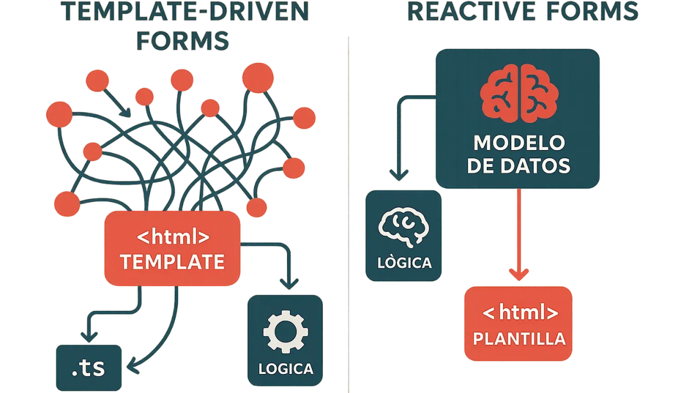

# 📚 DAY 8 - Formularios y validaciones

## 📖 Tabla de Contenidos

1. [Formularios reactivos](#1-formularios-reactivos)
2. [FormGroup](#2-formgroup)
3. [FormControl](#3-formcontrol)
4. [Validadores](#4-validadores)
5. [Estados del formulario](#5-estados-del-formulario)
- [valid](#valid)
- [invalid](#invalid)
- [touched](#touched)
- [dirty](#dirty)
6. [Mensajes de error](#6-mensajes-de-error)
7. [Validación antes de enviar](#7-validación-antes-de-enviar)
8. [Diferencia entre validación frontend y backend](#8-diferencia-entre-validación-frontend-y-backend)  
   [Resumen Visual](#resumen-visual)  
   [Referencias y Recursos](#referencias-y-recursos)
---

## Teoría

### 1. Formularios reactivos
Los **formularios reactivos** (Reactive Forms) son una forma de construir y gestionar 
formularios en Angular basada en un modelo reactivo y programático. A diferencia de 
los formularios por plantilla (Template-Driven Forms), los formularios reactivos se 
definen completamente en el código TypeScript del componente, lo que ofrece mayor control, 
escalabilidad y capacidad de testing.

En los formularios reactivos, la lógica de validación, el estado del formulario y los valores 
están centralizados en el componente, facilitando la creación de formularios complejos con 
validaciones dinámicas.

  
*Figura 1: Los formularios reactivos en Angular permiten construir formularios dinámicos con 
validaciones y estado gestionados desde el código TypeScript.  
Fuente: [angular.dev](https://angular.dev/guide/forms/reactive-forms)*

**Ejemplo básico:**
```typescript
import { FormGroup, FormControl } from '@angular/forms';

this.miFormulario = new FormGroup({
  nombre: new FormControl(''),
  email: new FormControl('')
});
```

---

### 2. FormGroup
Un **FormGroup** es una colección de controles de formulario agrupados bajo un mismo objeto. 
Representa un formulario completo o una sección de él, y permite gestionar el estado y los valores 
de múltiples campos de forma conjunta.

Cada FormGroup rastrea el valor agregado y el estado de validación de todos sus controles hijos, lo 
que facilita validar y manejar formularios complejos con múltiples campos relacionados.

**Características principales:**
- Agrupa varios `FormControl` o incluso otros `FormGroup` (formularios anidados).
- Permite acceder al valor completo del formulario mediante `.value`.
- Proporciona métodos para validar, resetear o actualizar el estado del formulario.

**Ejemplo:**
```typescript
import { FormGroup, FormControl } from '@angular/forms';

this.registroForm = new FormGroup({
  usuario: new FormControl(''),
  password: new FormControl(''),
  perfil: new FormGroup({
    nombre: new FormControl(''),
    apellido: new FormControl('')
  })
});
```

---

### 3. FormControl
Un **FormControl** es la unidad básica de un formulario reactivo. Representa un único campo de entrada 
(input, select, textarea, etc.) y rastrea su valor, su estado de validación y si ha sido modificado o 
tocado por el usuario.

Cada FormControl puede tener:
- un valor inicial,
- validadores síncronos,
- validadores asíncronos.

**Características principales:**
- Representa un solo campo del formulario.
- Permite definir validaciones específicas para ese campo.
- Proporciona propiedades como `value`, `valid`, `invalid`, `touched`, `dirty`, etc.

**Ejemplo:**
```typescript
import { FormControl, Validators } from '@angular/forms';

this.emailControl = new FormControl('', [
  Validators.required,
  Validators.email
]);
```

---

### 4. Validadores
Los **validadores** (Validators) son funciones que determinan si un control o un grupo de controles cumple 
con ciertas reglas o restricciones. Angular proporciona un conjunto de validadores predefinidos y también 
permite crear validadores personalizados.

Los validadores pueden ser:
- **Síncronos**: evalúan el valor inmediatamente (ej. `required`, `minLength`, `email`).
- **Asíncronos**: realizan validaciones que requieren operaciones asíncronas, como consultar un servidor 
(ej. verificar si un email ya está registrado).

**Validadores comunes incluidos en Angular:**
- `Validators.required` → el campo no puede estar vacío.
- `Validators.email` → el campo debe tener formato de email válido.
- `Validators.minLength(n)` → el campo debe tener al menos n caracteres.
- `Validators.maxLength(n)` → el campo no puede exceder n caracteres.
- `Validators.pattern(regex)` → el campo debe coincidir con una expresión regular.

**Ejemplo:**
```typescript
import { FormControl, Validators } from '@angular/forms';

this.passwordControl = new FormControl('', [
  Validators.required,
  Validators.minLength(8)
]);
```

**Validador personalizado:**
```typescript
function soloLetras(control: FormControl) {
  const valor = control.value;
  const regex = /^[a-zA-Z]+$/;
  return regex.test(valor) ? null : { soloLetras: true };
}

this.nombreControl = new FormControl('', [soloLetras]);
```

---

### 5. Estados del formulario
Angular rastrea automáticamente el estado de cada control y del formulario completo, proporcionando información 
útil sobre la interacción del usuario y la validez de los datos ingresados. Estos estados ayudan a decidir 
cuándo mostrar mensajes de error, habilitar o deshabilitar botones, y mejorar la experiencia del usuario.

#### valid 
Indica que el control o formulario cumple con todas las validaciones establecidas.

**Uso típico:**
- Habilitar el botón de envío solo si el formulario es válido.

**Ejemplo:**
```html
<button [disabled]="!miFormulario.valid">Enviar</button>
```

#### invalid
Indica que el control o formulario **no** cumple con al menos una de las validaciones.

**Uso típico:**
- Mostrar mensajes de error cuando un campo es inválido.

**Ejemplo:**
```html
@if (emailControl.invalid && emailControl.touched) {
  <p class="error">Email inválido</p>
}
```

#### touched
Indica que el usuario ha interactuado con el campo (hizo foco y luego salió del campo, disparando 
el evento `blur`).

**Uso típico:**
- Mostrar mensajes de error solo después de que el usuario haya tocado el campo, evitando mostrar 
errores prematuramente.

**Ejemplo:**
```html
@if (nombreControl.invalid && nombreControl.touched) {
  <span class="error">El nombre es obligatorio</span>
}
```

#### dirty
Indica que el usuario ha modificado el valor del campo desde su valor inicial.

**Uso típico:**
- Detectar cambios no guardados en un formulario.
- Mostrar advertencias al salir de una página si hay cambios sin guardar.

**Ejemplo:**
```typescript
if (this.miFormulario.dirty) {
  console.log('El formulario tiene cambios sin guardar');
}
```

---

### 6. Mensajes de error
Los **mensajes de error** son retroalimentación visual que se muestra al usuario cuando un campo no cumple 
con las validaciones establecidas. Es una buena práctica mostrar mensajes claros, específicos y contextuales 
para guiar al usuario a corregir el problema.

**Buenas prácticas:**
- Mostrar errores solo después de que el usuario haya interactuado con el campo (`touched` o `dirty`).
- Proporcionar mensajes específicos según el tipo de error (ej. "El email es obligatorio" vs "El formato del email es inválido").
- Usar clases CSS para resaltar visualmente los campos con errores.

**Ejemplo:**
```html
@if (emailControl.invalid && emailControl.touched) {
  @if (emailControl.hasError('required')) {
    <p class="error">El email es obligatorio.</p>
  }
  @if (emailControl.hasError('email')) {
    <p class="error">El formato del email no es válido.</p>
  }
}
```

**Ejemplo con CSS:**
```css
.error {
  color: red;
  font-size: 0.875rem;
}

input.ng-invalid.ng-touched {
  border-color: red;
}
```

---

### 7. Validación antes de enviar
La **validación antes de enviar** es una técnica que consiste en verificar que todo el formulario sea válido 
antes de permitir que se envíe al servidor. Esto previene el envío de datos incorrectos o incompletos y mejora 
la experiencia del usuario al proporcionar retroalimentación inmediata.

**Estrategias comunes:**
- Deshabilitar el botón de envío si el formulario es inválido.
- Marcar todos los campos como `touched` al intentar enviar, para mostrar todos los errores.
- Mostrar un mensaje general indicando que hay errores en el formulario.

**Ejemplo de deshabilitar botón:**
```html
<button [disabled]="!miFormulario.valid" (click)="enviarFormulario()">
  Guardar
</button>
```

**Ejemplo de marcar todos los campos como touched:**
```typescript
enviarFormulario() {
  if (this.miFormulario.invalid) {
    this.miFormulario.markAllAsTouched();
    return;
  }

  // Procesar el formulario
  console.log(this.miFormulario.value);
}
```

---

### 8. Diferencia entre validación frontend y backend
En el desarrollo de aplicaciones web modernas, la validación de datos debe realizarse tanto en el **frontend** 
(lado del cliente) como en el **backend** (lado del servidor). Cada una cumple un propósito distinto y ambas son 
necesarias para garantizar la seguridad, integridad y calidad de los datos.

#### Diferencias Clave

| Aspecto                  | Validación Frontend                                           | Validación Backend                                            |
|--------------------------|---------------------------------------------------------------|---------------------------------------------------------------|
| **Propósito**            | Mejorar la experiencia del usuario con retroalimentación inmediata. | Garantizar la seguridad e integridad de los datos.            |
| **Ubicación**            | Se ejecuta en el navegador del usuario (Angular).              | Se ejecuta en el servidor (Node.js, Java, .NET, etc.).        |
| **Puede evitarse**       | Sí, un usuario técnico puede desactivar JavaScript o manipular el código. | No, es la última línea de defensa y no puede ser evitada.     |
| **Velocidad**            | Instantánea, sin necesidad de comunicación con el servidor.    | Requiere una petición HTTP, es más lenta.                     |
| **Ejemplos**             | Validar formato de email, longitud mínima, campos requeridos.  | Verificar si un email ya está registrado, validar permisos, reglas de negocio complejas. |

**En resumen:**
- **Validación frontend**: mejora UX, da feedback rápido, pero puede ser evitada.
- **Validación backend**: es obligatoria, garantiza seguridad y no puede ser manipulada por el usuario.

**Ejemplo práctico:**
```typescript
// Frontend: validación de formato
this.emailControl = new FormControl('', [Validators.required, Validators.email]);

// Backend (Node.js ejemplo):
if (!email || !isValidEmail(email)) {
  return res.status(400).json({ error: 'Email inválido' });
}
```

**Nota importante:**  
Angular también cuenta con **Signal Forms**, una nueva API experimental basada en signals para gestionar formularios. 
Sin embargo, la documentación oficial indica que aún están en fase experimental, por lo que para este plan de formación 
junior se priorizan los **formularios reactivos tradicionales**. Signal Forms se mencionan solo como conocimiento futuro 
a explorar cuando se estabilicen.

---

### Resumen Visual

| Concepto                                  | Resumen breve                                                                                                       |
|-------------------------------------------|---------------------------------------------------------------------------------------------------------------------|
| Formularios reactivos                     | Modelo programático de formularios gestionado desde TypeScript, con mayor control y escalabilidad.                  |
| FormGroup                                 | Agrupa múltiples controles y rastrea el estado y validez del formulario completo.                                   |
| FormControl                               | Representa un único campo del formulario, con su valor, validaciones y estados.                                     |
| Validadores                               | Funciones que verifican si un campo cumple ciertas reglas (required, email, minLength, etc.).                       |
| valid / invalid                           | Indica si el control o formulario cumple o no con todas las validaciones.                                           |
| touched                                   | Indica que el usuario interactuó con el campo (hizo foco y salió).                                                  |
| dirty                                     | Indica que el usuario modificó el valor del campo desde su estado inicial.                                          |
| Mensajes de error                         | Retroalimentación visual específica y contextual cuando un campo no cumple validaciones.                            |
| Validación antes de enviar                | Verificar que el formulario sea válido antes de enviarlo al servidor, mejorando UX y previniendo errores.           |
| Diferencia frontend / backend             | Frontend valida para UX inmediata; backend valida para seguridad e integridad (ambas son necesarias).               |

---

## Referencias y Recursos

- 📌 [Angular Docs: Reactive Forms](https://angular.dev/guide/forms/reactive-forms)
- 📌 [Angular Docs: Form Validation](https://angular.dev/guide/forms/form-validation)
- 📌 [Angular Docs: FormControl](https://angular.dev/api/forms/FormControl)
- 📌 [Angular Docs: FormGroup](https://angular.dev/api/forms/FormGroup)
- 📌 [Angular Docs: Validators](https://angular.dev/api/forms/Validators)
- 📌 [FreeCodeCamp: Angular Forms](https://www.freecodecamp.org/news/angular-forms-tutorial/)


---
### 📄 METADATOS DEL DOCUMENTO

| Campo                    | Detalles                                                           |
|:-------------------------|:-------------------------------------------------------------------|
| **Título**               | DAY 8 - FORMULARIOS Y VALIDACIONES                                 |
| **Autor(es)**            | Saul Echeverri                                                     |
| **Versión**              | 1.0.0                                                              |
| **Fecha de Creación**    | 02 de Junio de 2026                                                |
| **Última Actualización** | 02 de Junio de 2026                                                 |
| **Notas Adicionales**    | Documento base de referencia para el plan de formación en Angular. |

---

