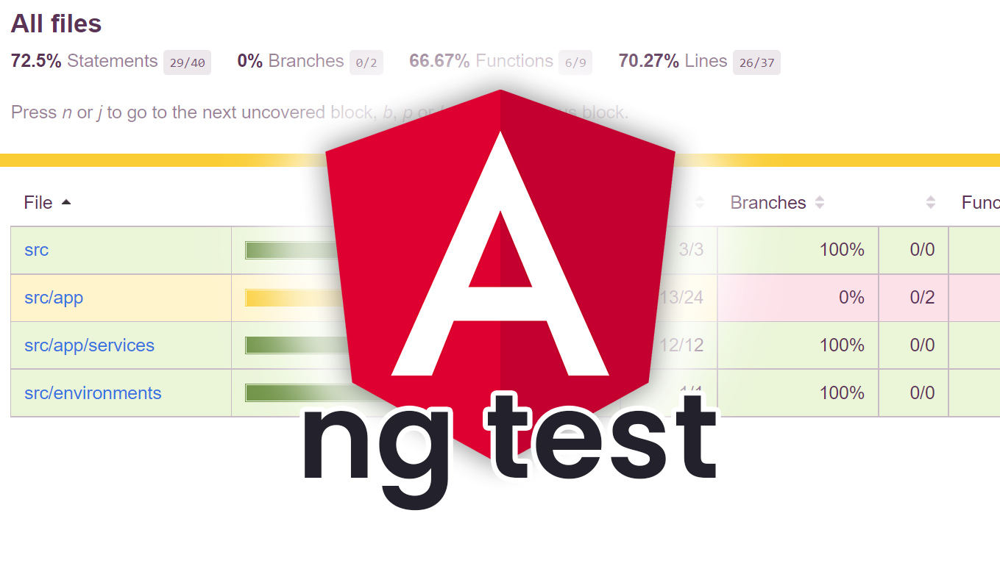

# 📚 DAY 9 - Testing para prevenir regresiones

## 📖 Tabla de Contenidos

1. [¿Por qué se escriben pruebas?](#1-por-qué-se-escriben-pruebas)
2. [Pruebas unitarias de servicios](#2-pruebas-unitarias-de-servicios)
3. [Pruebas básicas de componentes](#3-pruebas-básicas-de-componentes)
4. [TestBed](#4-testbed)
5. [Arrange, Act, Assert](#5-arrange-act-assert)
6. [Mocks](#6-mocks)
7. [Pruebas para bugs corregidos](#7-pruebas-para-bugs-corregidos)
8. [Concepto de regresión](#8-concepto-de-regresión)  
   [Resumen Visual](#resumen-visual)  
   [Referencias y Recursos](#referencias-y-recursos)
---

## Teoría

### 1. ¿Por qué se escriben pruebas?
Las **pruebas automatizadas** son código que verifica que otro código funciona correctamente. No son opcionales en 
un proyecto profesional: son una inversión que protege el trabajo ya realizado y da confianza para seguir avanzando 
sin miedo a romper lo que ya funciona.

Escribir pruebas responde a una pregunta fundamental:

> *"¿Cómo sé que lo que construí funciona, y seguirá funcionando cuando cambie algo más?"*

**Razones principales para escribir pruebas:**
- **Detectar errores temprano**: Un bug encontrado en desarrollo cuesta mucho menos que uno encontrado en producción.
- **Documentación viva**: Una prueba bien escrita describe exactamente qué debe hacer el código.
- **Confianza para refactorizar**: Puedes mejorar el código sabiendo que las pruebas te avisarán si algo deja de funcionar.
- **Prevenir regresiones**: Evitan que un cambio nuevo rompa funcionalidades que ya estaban bien.
- **Facilitar el trabajo en equipo**: Cualquier desarrollador puede entender qué hace un módulo leyendo sus pruebas.


<br>
*Figura 1: Las pruebas automatizadas verifican que el código funciona correctamente y previenen que cambios futuros rompan 
funcionalidades existentes.  
Fuente: [codigoencasa.com](https://codigoencasa.com/pruebas-unitarias-en-angular/)*

**Tipos de pruebas más comunes:**

| Tipo | Qué prueba | Velocidad | Ejemplo |
|------|-----------|-----------|---------|
| **Unitaria** | Una función o clase aislada | Muy rápida | Probar `filterProducts()` del servicio |
| **Integración** | Varios módulos juntos | Media | Probar componente + servicio |
| **E2E (End to End)** | Flujo completo de usuario | Lenta | Simular click y navegación real |

---

### 2. Pruebas unitarias de servicios
Una **prueba unitaria de servicio** verifica que los métodos de un servicio Angular producen los resultados esperados de forma 
aislada, sin depender de otros módulos, componentes o peticiones HTTP reales.

El objetivo es probar **una unidad de lógica a la vez**, controlando el entorno para que nada externo interfiera.

**¿Qué se prueba en un servicio?**
- Que los métodos devuelven los valores correctos.
- Que la lógica de filtrado, transformación o validación funciona bien.
- Que los Observables emiten los datos esperados.
- Que los errores se manejan correctamente.

**Ejemplo de Estructura básica de una prueba de servicio:**
```typescript
import { TestBed } from '@angular/core/testing';
import { ProductService } from './product.service';

describe('ProductService', () => {
  let service: ProductService;

  beforeEach(() => {
    TestBed.configureTestingModule({});
    service = TestBed.inject(ProductService);
  });

  it('debería crearse correctamente', () => {
    expect(service).toBeTruthy();
  });

  it('debería devolver todos los productos en estado success', (done) => {
    service.getProducts('success').subscribe(products => {
      expect(products.length).toBeGreaterThan(0);
      done();
    });
  });

  it('debería devolver lista vacía en estado empty', (done) => {
    service.getProducts('empty').subscribe(products => {
      expect(products.length).toBe(0);
      done();
    });
  });
});
```
**Partes clave:**

- `describe()` — agrupa pruebas relacionadas bajo un nombre descriptivo.
- `beforeEach()` — se ejecuta antes de cada prueba para preparar el entorno.
- `it()` — define una prueba individual con su descripción y lógica.
- `expect()` — hace una afirmación sobre el resultado esperado.

---

### 3. Pruebas básicas de componentes
Una **prueba de componente** verifica que un componente Angular se renderiza correctamente, responde a entradas (`@Input`) y emite eventos (`@Output`) según lo esperado.

A diferencia de las pruebas de servicio, aquí necesitas el entorno de Angular para compilar la plantilla y detectar cambios.

**¿Qué se prueba en un componente?**
- Que el componente se crea sin errores.
- Que renderiza correctamente con los datos recibidos.
- Que responde bien a cambios en sus inputs.
- Que emite los eventos correctos ante interacciones del usuario.
- Que el template muestra u oculta elementos según el estado.
- 
**Ejemplo básico:**
```typescript
import { ComponentFixture, TestBed } from '@angular/core/testing';
import { ProductList } from './product-list';
import { Product } from '../models/product';

describe('ProductList', () => {
  let component: ProductList;
  let fixture: ComponentFixture<ProductList>;

  beforeEach(async () => {
    await TestBed.configureTestingModule({
      imports: [ProductList],
    }).compileComponents();

    fixture = TestBed.createComponent(ProductList);
    component = fixture.componentInstance;
    fixture.detectChanges();
  });

  it('debería crearse correctamente', () => {
    expect(component).toBeTruthy();
  });

  it('debería renderizar un producto por cada elemento recibido', () => {
    const mockProducts: Product[] = [
      { id: '1', name: 'Laptop', price: 1500, stock: 5, category: 'Electrónica', isActive: true },
      { id: '2', name: 'Mouse', price: 25, stock: 10, category: 'Electrónica', isActive: true },
    ];

    // Asignar input
    component.products = signal(mockProducts);
    fixture.detectChanges();

    // Verificar que se renderizaron ambas cards
    const cards = fixture.nativeElement.querySelectorAll('app-product-card');
    expect(cards.length).toBe(2);
  });
});
```

**Conceptos clave:**

- `ComponentFixture` — envoltura del componente para interactuar con él en las pruebas.
- `fixture.detectChanges()` — dispara el ciclo de detección de cambios (actualiza la vista).
- `fixture.nativeElement` — acceso al DOM del componente.
- `compileComponents()` — compila las plantillas del componente.

---

### 4. TestBed
**TestBed** es la herramienta principal de Angular para configurar y crear un entorno de pruebas. Actúa como un módulo de Angular simulado que te permite instanciar componentes, servicios e inyectar dependencias en un contexto controlado.

Sin `TestBed`, no podrías usar el sistema de inyección de dependencias de Angular en tus pruebas.

**¿Qué hace TestBed?**
- Crea un módulo Angular temporal solo para las pruebas.
- Permite configurar qué servicios, componentes e imports estarán disponibles.
- Proporciona métodos para instanciar y obtener componentes y servicios.

**Métodos más importantes:**

| Método | Para qué sirve |
|--------|---------------|
| `TestBed.configureTestingModule({})` | Configura el módulo de pruebas |
| `TestBed.inject(Servicio)` | Obtiene una instancia del servicio |
| `TestBed.createComponent(Componente)` | Crea una instancia del componente |
| `compileComponents()` | Compila las plantillas HTML del componente |

**Ejemplo:**
```typescript
beforeEach(async () => {
  await TestBed.configureTestingModule({
    imports: [ProductFormPage],        // Componente standalone a probar
    providers: [
      { provide: ProductService, useValue: mockProductService } // Mock del servicio
    ]
  }).compileComponents();
});
```

**Flujo típico con TestBed:**
```
TestBed.configureTestingModule()  →  Prepara el módulo de prueba
        ↓
TestBed.createComponent()         →  Crea el componente
        ↓
fixture.detectChanges()           →  Renderiza la vista inicial
        ↓
expect(...)                       →  Verifica el resultado
```
---

### 5. Arrange, Act, Assert
**Arrange, Act, Assert (AAA)** es el patrón estándar para estructurar pruebas unitarias. 
Divide cada prueba en tres partes claras que hacen el código de prueba fácil de leer y mantener.

  
*Figura 2: El patrón Arrange, Act, Assert divide cada prueba en preparación, ejecución y verificación.  
Fuente: [semaphore.io](https://semaphore.io/blog/aaa-pattern-test-automation)*

#### 🔵 Arrange (Preparar)
Configura todo lo necesario para ejecutar la prueba.

- Crear datos de prueba (mocks).
- Inicializar el componente o servicio.
- Configurar dependencias.

```typescript
// ARRANGE
const productos: Product[] = [
  { id: '1', name: 'Laptop', price: 1500, stock: 5, category: 'Electrónica', isActive: true }
];
const searchTerm = 'lap';
const onlyAvailable = false;
```

#### 🟡 Act (Actuar)
Ejecuta la acción que quieres probar.

- Llamar al método.
- Simular un evento del usuario.
- Disparar la operación bajo prueba.

```typescript
// ACT
const resultado = service.filterProducts(productos, searchTerm, onlyAvailable);
```

#### 🟢 Assert (Verificar)
Comprueba que el resultado es el esperado.

- Usar `expect()` con matchers de Jasmine.
- Verificar valores, longitudes, propiedades, etc.

```typescript
// ASSERT
expect(resultado.length).toBe(1);
expect(resultado[0].name).toBe('Laptop');
```

**Ejemplo completo con AAA:**
```typescript
it('debería filtrar productos por nombre correctamente', () => {
  // ARRANGE
  const productos: Product[] = [
    { id: '1', name: 'Laptop Gamer', price: 1500, stock: 5, category: 'Electrónica', isActive: true },
    { id: '2', name: 'Mouse Inalámbrico', price: 25, stock: 10, category: 'Electrónica', isActive: true },
  ];

  // ACT
  const resultado = service.filterProducts(productos, 'laptop', false);

  // ASSERT
  expect(resultado.length).toBe(1);
  expect(resultado[0].name).toBe('Laptop Gamer');
});
```

**Matchers comunes de Jasmine:**

| Matcher | Qué verifica |
|---------|-------------|
| `expect(x).toBe(y)` | Igualdad estricta (`===`) |
| `expect(x).toEqual(y)` | Igualdad profunda (objetos) |
| `expect(x).toBeTruthy()` | Que el valor es verdadero |
| `expect(x).toBeFalsy()` | Que el valor es falso |
| `expect(x).toBeNull()` | Que el valor es `null` |
| `expect(x).toBeUndefined()` | Que el valor es `undefined` |
| `expect(x).toBeDefined()` | Que el valor existe |
| `expect(x).toBe(0)` | Que el valor es 0 |
| `expect(x).toBeGreaterThan(n)` | Que x es mayor que n |
| `expect(x).toContain(item)` | Que el arreglo contiene el elemento |
| `expect(fn).toThrow()` | Que la función lanza un error |

---

### 6. Mocks
Un **mock** es un objeto o función falsa que simula el comportamiento de una dependencia real en un 
entorno de prueba. Se usa para aislar la unidad que estás probando y controlar exactamente qué devuelven 
sus dependencias.

**¿Por qué usar mocks?**
- Para no depender de servicios externos (APIs, bases de datos).
- Para controlar los datos que devuelve una dependencia.
- Para hacer las pruebas más rápidas y predecibles.
- Para simular escenarios difíciles de reproducir (errores de red, respuestas vacías).

**Tipos de mocks:**

| Tipo | Descripción | Ejemplo |
|------|-------------|---------|
| **Mock de objeto** | Objeto que reemplaza una clase real | `{ getProducts: () => of([]) }` |
| **Spy** | Función que registra sus llamadas | `spyOn(service, 'getProducts')` |
| **Stub** | Versión simplificada de una dependencia | Función que siempre devuelve un valor fijo |

**Ejemplo de spy:**
```typescript
it('debería llamar a getProducts al iniciar', () => {
  // Crear un spy sobre el método real
  const spy = spyOn(service, 'getProducts').and.returnValue(of([]));

  component.ngOnInit();

  // Verificar que fue llamado
  expect(spy).toHaveBeenCalled();
  expect(spy).toHaveBeenCalledWith('success');
});
```

**Ejemplo de mock de Observable con error:**
```typescript
import { throwError } from 'rxjs';

mockProductService.getProducts.and.returnValue(
  throwError(() => new Error('Error de red'))
);
```

---

### 7. Pruebas para bugs corregidos
Cuando encuentras y corriges un bug, la mejor práctica es **escribir una prueba que reproduzca ese bug antes 
de corregirlo** y que luego pase después de la corrección.

Esto garantiza dos cosas:
1. El bug está documentado y cubierto.
2. Si alguien introduce el mismo bug en el futuro, la prueba fallará y lo detectará.

**¿Por qué es importante?**
- Sin prueba, el bug puede reaparecer sin que nadie lo note.
- Con prueba, el error queda documentado como comportamiento no deseado.
- Forma parte de las buenas prácticas de desarrollo profesional.

**Flujo recomendado:**
```
1. Detectar el bug
       ↓
2. Escribir una prueba que FALLA reproduciendo el bug
       ↓
3. Corregir el bug en el código
       ↓
4. Verificar que la prueba ahora PASA
       ↓
5. El bug queda cubierto para siempre
```

**Ejemplo — Bug corregido en Día 7:**
> Bug: El loading no se desactivaba cuando la petición fallaba.

```typescript
it('debería desactivar loading cuando la petición falla', () => {
  // ARRANGE
  mockProductService.getProducts.and.returnValue(
    throwError(() => new Error('Error de red'))
  );

  // ACT
  component.loadProducts('error');

  // ASSERT
  expect(component.loading()).toBe(false);
  expect(component.errorMessage()).not.toBeNull();
});
```

**Ejemplo — Bug de precio null:**
```typescript
it('debería mostrar "Precio no disponible" si el precio es null', () => {
  // ARRANGE
  const productoSinPrecio: Product = {
    id: '1', name: 'Laptop', price: null as any,
    stock: 5, category: 'Electrónica', isActive: true
  };

  // ACT
  component.product.set(productoSinPrecio);
  fixture.detectChanges();

  // ASSERT
  const precioElement = fixture.nativeElement.querySelector('.price');
  expect(precioElement.textContent).toContain('Precio no disponible');
});
```

---

### 8. Concepto de regresión
Una **regresión** es cuando un cambio en el código rompe una funcionalidad que antes funcionaba correctamente. Es uno de los problemas más comunes 
y costosos en el desarrollo de software.

> *"Arreglé el bug A, pero sin querer rompí la funcionalidad B."*

**¿Cómo ocurre una regresión?**
- Modificas un servicio para agregar un feature y, sin darte cuenta, cambias la lógica de un método que otro componente usa.
- Cambias el modelo de datos y no actualizas todos los lugares que lo usan.
- Refactorizas un componente y alteras su comportamiento esperado.

**¿Cómo previenen las pruebas las regresiones?**

```
Código funciona correctamente
           ↓
Se escriben pruebas que documentan ese comportamiento
           ↓
Desarrollador hace un cambio nuevo
           ↓
Las pruebas se ejecutan automáticamente
           ↓
   ✅ Todas pasan → cambio seguro
   ❌ Alguna falla → regresión detectada antes de llegar a producción
```

**Ejemplo de regresión:**

Supón que tienes este método en tu servicio:
```typescript
filterProducts(products: Product[], search: string, onlyAvailable: boolean): Product[] {
  return products.filter(p =>
    p.name.toLowerCase().includes(search.toLowerCase()) &&
    (!onlyAvailable || p.stock > 0)
  );
}
```

Alguien lo modifica sin querer:
```typescript
// ❌ Cambio accidental que rompe el filtro por disponibilidad
filterProducts(products: Product[], search: string, onlyAvailable: boolean): Product[] {
  return products.filter(p =>
    p.name.toLowerCase().includes(search.toLowerCase())
    // Se eliminó la condición de disponibilidad por error
  );
}
```

Sin pruebas, este error llegaría a producción.  
Con pruebas, esta prueba fallaría inmediatamente:

```typescript
it('debería filtrar solo productos disponibles cuando onlyAvailable es true', () => {
  // ARRANGE
  const productos: Product[] = [
    { id: '1', name: 'Laptop', price: 1500, stock: 0, category: 'Electrónica', isActive: true },
    { id: '2', name: 'Mouse', price: 25, stock: 5, category: 'Electrónica', isActive: true },
  ];

  // ACT
  const resultado = service.filterProducts(productos, '', true);

  // ASSERT
  expect(resultado.length).toBe(1);          // ← Esta prueba fallaría con el cambio accidental
  expect(resultado[0].name).toBe('Mouse');
});
```

---

### Resumen Visual

| Concepto | Resumen breve |
|----------|--------------|
| ¿Por qué escribir pruebas? | Detectar errores temprano, documentar comportamiento, prevenir regresiones y dar confianza para refactorizar. |
| Pruebas unitarias de servicios | Verifican que los métodos de un servicio producen resultados correctos de forma aislada. |
| Pruebas básicas de componentes | Verifican que un componente se renderiza bien y responde correctamente a inputs y eventos. |
| TestBed | Herramienta de Angular que crea un módulo simulado para instanciar componentes y servicios en pruebas. |
| Arrange, Act, Assert | Patrón que estructura cada prueba en tres partes: preparar datos, ejecutar la acción y verificar el resultado. |
| Mocks | Objetos o funciones falsas que simulan dependencias reales para aislar y controlar las pruebas. |
| Pruebas para bugs corregidos | Escribir una prueba que reproduzca el bug antes de corregirlo, para que no vuelva a aparecer. |
| Regresión | Cuando un cambio nuevo rompe una funcionalidad que antes funcionaba. Las pruebas las detectan automáticamente. |


---

## Referencias y Recursos

- 📌 [Angular Docs: Testing](https://angular.dev/guide/testing)
- 📌 [codigoencasa.com](https://codigoencasa.com/pruebas-unitarias-en-angular/)
- 📌 [semaphore.io](https://semaphore.io/blog/aaa-pattern-test-automation)

---
### 📄 METADATOS DEL DOCUMENTO

| Campo                    | Detalles                                                           |
|:-------------------------|:-------------------------------------------------------------------|
| **Título**               | DAY 9 - TESTING PARA PREVENIR REGRESIONES                          |
| **Autor(es)**            | Saul Echeverri                                                     |
| **Versión**              | 1.0.0                                                              |
| **Fecha de Creación**    | 25 de Junio de 2026                                                |
| **Última Actualización** | 25 de Junio de 2026                                                |
| **Notas Adicionales**    | Documento base de referencia para el plan de formación en Angular. |

---

